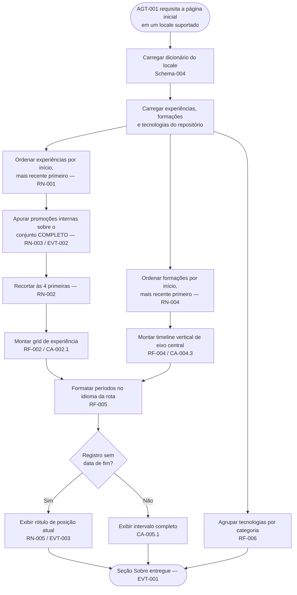
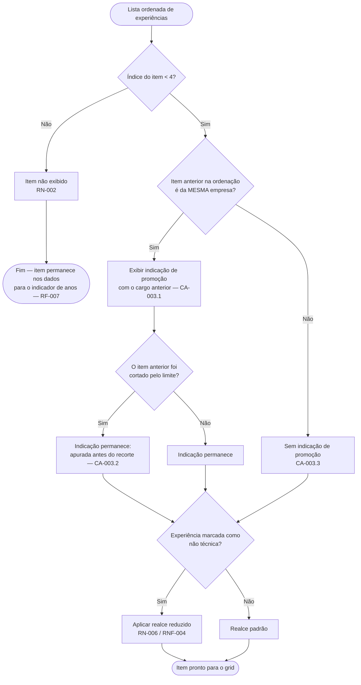
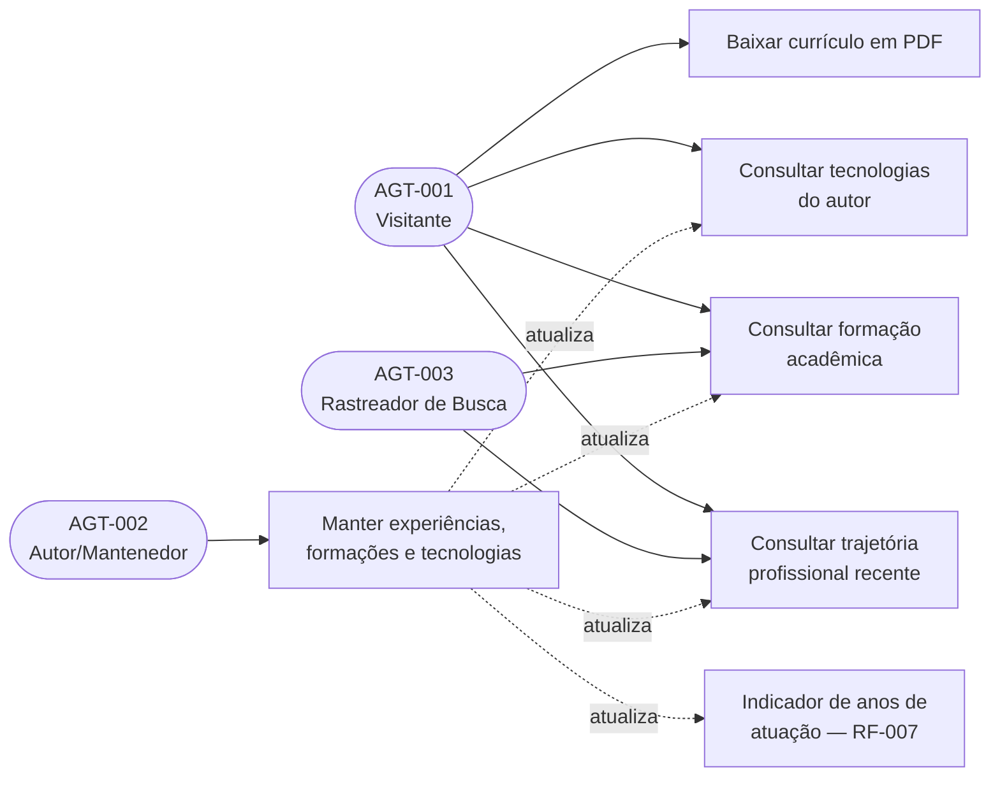

# Especificação de Requisitos de Software (ERS)

**Projeto:** Portfólio Arthur.Correa — Módulo Sobre (About)
**Cliente/Órgão:** Arthur de Paula Correa (produto pessoal)
**Data:** 10/08/2026
**Versão:** 1.0

## Histórico de Revisões

| Versão | Data       | Autor                  | Descrição das Alterações                                                                                                                                                                |
| ------ | ---------- | ---------------------- | --------------------------------------------------------------------------------------------------------------------------------------------------------------------------------------- |
| 1.0    | 10/08/2026 | Arthur de Paula Correa | Criação do documento do módulo Sobre, formalizando o comportamento já implementado (bio, experiência, formação, tecnologias) e as novas regras de recorte da experiência e da formação. |

---

## 1. Introdução

_(Em conformidade com a norma ISO/IEC/IEEE 29148)_

### 1.1. Propósito do Documento

Este documento descreve as especificações de requisitos de software para o **módulo Sobre** do portfólio Arthur.Correa — a seção da página inicial que apresenta o autor, sua trajetória profissional, sua formação acadêmica e as tecnologias que domina.

O módulo foi implementado antes da existência desta especificação. Portanto, este documento cumpre duas funções simultâneas: **formalizar o comportamento já em produção** e **especificar as novas regras de negócio solicitadas** — o recorte da experiência profissional às quatro posições mais recentes, apresentadas em grid, e a apresentação da formação acadêmica como linha do tempo vertical de eixo central.

O documento é derivado do pedido do autor registrado em conversa e do protótipo de interface validado externamente (ver Seção 10, Anexo C).

### 1.2. Escopo do Produto

O módulo Sobre é uma superfície pública, estática e somente leitura do portfólio. Não possui autenticação, formulários, persistência nem chamadas a serviços externos em tempo de requisição: todas as informações são fatos declarados no repositório (`data/works.ts`, `data/education.ts`, `data/technologies.ts`) e textos de interface declarados nos dicionários por locale, renderizados no servidor.

O que o sistema fará:

- Apresentar a identificação do autor (retrato, texto biográfico em parágrafos) e disponibilizar o download do currículo em PDF.
- Exibir a **experiência profissional** em um grid, restrito às **quatro posições mais recentes**, ordenadas da mais recente para a mais antiga.
- Sinalizar, em cada posição, quando ela representa uma **promoção interna** em relação à posição imediatamente anterior na mesma empresa.
- Atenuar visualmente as posições marcadas como não relacionadas à área de tecnologia, sem removê-las da listagem.
- Exibir a **formação acadêmica** como uma **linha do tempo vertical com eixo (linha) central**, com todos os registros cadastrados, do início mais recente para o mais antigo.
- Exibir as **tecnologias** agrupadas por categoria.
- Exibir períodos (início–fim) formatados no idioma resolvido pela rota, substituindo o fim ausente por um rótulo de "atual".
- Exibir todo texto de interface no idioma resolvido pela rota, a partir dos dicionários por locale.

O que o sistema **NÃO** fará (Fora do Escopo):

- Não haverá cadastro, edição ou remoção de experiências, formações ou tecnologias por interface: a manutenção é feita editando os arquivos sob `data/` no repositório.
- Não haverá paginação, filtro, busca ou ordenação escolhida pelo visitante.
- Não haverá página ou rota dedicada de "trajetória completa" nesta entrega — ver QA-002 (Seção 2.2).
- Não haverá recorte quantitativo na formação acadêmica: o limite de quatro itens aplica-se exclusivamente à experiência profissional.
- Não haverá integração com serviços externos (LinkedIn, GitHub, WakaTime) para popular ou validar a trajetória.
- Não haverá coleta de métricas de uso, analytics ou rastreamento do download do currículo.

### 1.3. Agentes (AGT)

| ID      | Agente (AGT)        | Descrição                                                                                                                                       | Nível de Acesso          |
| ------- | ------------------- | ----------------------------------------------------------------------------------------------------------------------------------------------- | ------------------------ |
| AGT-001 | Visitante           | Pessoa que acessa publicamente o portfólio para conhecer o autor, sua trajetória e sua formação. Único agente humano interativo do módulo.      | Público, somente leitura |
| AGT-002 | Autor/Mantenedor    | Responsável por manter `data/works.ts`, `data/education.ts`, `data/technologies.ts`, o arquivo do currículo em PDF e os textos dos dicionários. | Acesso ao repositório    |
| AGT-003 | Rastreador de Busca | Robô de indexação (Google, Bing) que percorre a seção para indexar o conteúdo público.                                                          | Público, somente leitura |

### 1.4. Definições, Acrônimos e Abreviações

| Termo/Acrônimo   | Definição                                                                                                                                           |
| ---------------- | --------------------------------------------------------------------------------------------------------------------------------------------------- |
| ERS              | Especificação de Requisitos de Software.                                                                                                            |
| Experiência      | Posição profissional ocupada pelo autor, descrita por empresa, cargo, resumo e período (`data/works.ts`).                                           |
| Formação         | Registro acadêmico do autor, descrito por curso, instituição, resumo e período (`data/education.ts`).                                               |
| Promoção interna | Situação em que duas experiências consecutivas na ordem cronológica pertencem à mesma empresa, indicando ascensão de cargo sem troca de empregador. |
| Posição atual    | Experiência ou formação cujo fim não está definido (`endDate` nulo), interpretada como em andamento.                                                |
| Grid             | Arranjo em colunas que organiza os itens de experiência, com número de colunas variável conforme a largura da tela.                                 |
| Linha do tempo   | Arranjo vertical em que os itens de formação se distribuem ao longo de um eixo (linha) central contínuo.                                            |
| Locale           | Idioma resolvido pela rota (`en` ou `pt-BR`), declarado em `lib/i18n-config.ts`.                                                                    |
| Dicionário       | Arquivo por locale (`app/[lang]/dictionaries/*.json`) que contém todo texto de interface exibido ao visitante.                                      |
| Anos de atuação  | Indicador exibido na seção inicial (hero), derivado da soma das durações de **todas** as experiências cadastradas.                                  |

### 1.5. Referências

- Pedido do autor, registrado em conversa: organização da experiência em grid limitada às quatro mais recentes e conversão da formação em linha do tempo vertical de eixo central.
- Protótipo de interface no Claude Design (ver Seção 10, Anexo C).
- `docs/ers/projects.md` — ERS do módulo Projetos, referência de convenções deste conjunto documental.
- `ARCHITECTURE.md` — convenções de i18n, nomenclatura e estrutura de diretórios do repositório.
- `CURRICULUM.md` — fonte factual da trajetória profissional, formação e tecnologias do autor.
- Normas aplicadas: ABNT NBR ISO/IEC/IEEE 12207, ABNT NBR ISO/IEC 25030, ISO/IEC/IEEE 29148.
- WCAG 2.1, Nível AA — critérios de acessibilidade adotados nos RNF.

---

## 2. Descrição Geral do Sistema

### 2.1. Perspectiva do Produto

O módulo Sobre não é um produto independente: é uma seção da página inicial do portfólio, ancorada em `#about` e alcançável pela navegação principal. Ele compartilha fontes de dados com outras partes do sistema — em particular, `data/works.ts` alimenta tanto este módulo quanto o indicador "anos de atuação" da seção inicial, e `data/technologies.ts` alimenta tanto o agrupamento de tecnologias aqui quanto os selos de tecnologia do módulo Projetos.

Essa partilha é a razão de a regra de recorte descrita neste documento ser **de exibição**, e não de dados: reduzir o conjunto exibido nunca pode reduzir o conjunto considerado por outros consumidores das mesmas fontes.

### 2.2. Suposições e Dependências

**Suposições:**

- Os registros de experiência e formação são fatos verificáveis do currículo do autor, mantidos manualmente e considerados corretos no momento da renderização.
- Existirão sempre pelo menos quatro experiências cadastradas no horizonte previsível; ainda assim, o sistema deve se comportar corretamente com menos de quatro (RN-002).
- O visitante possui conexão à internet e navegador com suporte às tecnologias web correntes.

**Dependências:**

- Dicionários por locale completos e sincronizados entre si para todas as chaves do módulo.
- Arquivo do currículo em PDF disponível como ativo estático.
- Ativo de retrato do autor disponível como ativo estático.

**Questões em aberto (a decidir com o autor antes da implementação):**

- **QA-001 — Critério do recorte de quatro experiências.** A regra especificada em RN-002 seleciona as quatro experiências **mais recentes por data de início, independentemente de serem ou não da área de tecnologia**. Como a experiência atualmente mais recente está marcada como não relacionada à tecnologia (`techRelated: false`), existe uma leitura alternativa possível: exibir as quatro experiências **de tecnologia** mais recentes. Este documento adota a primeira leitura por ser a literal ("as últimas 4 experiências de trabalho"); confirmar antes de implementar.
- **QA-002 — Destino das experiências ocultadas.** Com o recorte, experiências mais antigas deixam de ser exibidas. Não foi definido se deve existir alguma forma de acessá-las (ação "ver trajetória completa", rota dedicada, ou apenas o currículo em PDF já disponível). Este documento assume que o currículo em PDF é o único destino, e não especifica nova ação de interface.
- **QA-003 — Detalhes visuais do protótipo.** O protótipo indicado no Anexo C não pôde ser lido durante a redação deste documento. Os requisitos abaixo derivam do pedido textual do autor e do comportamento hoje implementado. Detalhes puramente visuais (número exato de colunas por breakpoint, alternância lateral dos itens da linha do tempo, marcadores e espaçamentos) devem ser lidos diretamente do protótipo na etapa de implementação e não constituem regra de negócio.

---

## 3. Requisitos Funcionais (RF) e Critérios de Aceite (CA)

_(O que o sistema deve fazer. Baseado na ABNT NBR ISO/IEC/IEEE 12207)_

### Módulo: Sobre

#### RF-001: Apresentar a identificação e a biografia do autor

- **Descrição:** O sistema deve exibir o retrato do autor, seu texto biográfico em parágrafos e uma ação de download do currículo em PDF.
- **Agente(s) (AGT):** AGT-001 — Visitante
- **Regras de Negócio Associadas:** RN-006
- **Eventos Disparados (EVT):** EVT-001, EVT-004
- **Schema de Dados de Entrada/Saída:** Schema-004

**Critérios de Aceite (CA):**

- **CA-001.1 — Exibição da biografia**
  - Dado que o agente AGT-001 acessa a página inicial em um locale suportado
  - Quando a seção Sobre é renderizada
  - Então o sistema deve exibir o retrato com texto alternativo, todos os parágrafos biográficos do dicionário daquele locale, na ordem declarada, e a ação de download do currículo.
- **CA-001.2 — Download do currículo**
  - Dado que a seção Sobre está visível
  - Quando o agente AGT-001 aciona a ação de download do currículo
  - Então o sistema deve entregar o arquivo PDF do currículo como download, sem sair da página.

#### RF-002: Exibir a experiência profissional em grid, limitada às quatro mais recentes

- **Descrição:** O sistema deve exibir as experiências profissionais em um grid de itens de mesma estrutura, ordenadas da mais recente para a mais antiga e restritas às quatro primeiras dessa ordenação.
- **Agente(s) (AGT):** AGT-001 — Visitante
- **Regras de Negócio Associadas:** RN-001, RN-002, RN-005
- **Eventos Disparados (EVT):** EVT-001
- **Schema de Dados de Entrada/Saída:** Schema-001

**Critérios de Aceite (CA):**

- **CA-002.1 — Recorte e ordenação**
  - Dado que existem cinco ou mais experiências cadastradas
  - Quando a seção Sobre é renderizada
  - Então o sistema deve exibir exatamente quatro itens, correspondentes às quatro experiências de data de início mais recente, apresentadas da mais recente para a mais antiga.
- **CA-002.2 — Conteúdo de cada item**
  - Dado que uma experiência é exibida
  - Quando o item correspondente é renderizado
  - Então ele deve conter o período, o cargo no idioma da rota, o nome da empresa e o resumo da posição no idioma da rota.
- **CA-002.3 — Conjunto menor que o limite**
  - Dado que existem quatro ou menos experiências cadastradas
  - Quando a seção Sobre é renderizada
  - Então o sistema deve exibir todas elas, sem espaços vazios reservados e sem qualquer aviso de recorte.
- **CA-002.4 — Arranjo em grid responsivo**
  - Dado que o agente AGT-001 acessa a seção em uma tela estreita (a partir de 320px)
  - Quando a seção Sobre é renderizada
  - Então os itens de experiência devem se organizar em coluna única, e passar, conforme a largura disponível aumenta, a um arranjo assimétrico do tipo _bento_ sobre uma grade de 12 colunas — em que os itens podem ocupar larguras e proporções diferentes entre si —, sem que nenhum item fique cortado ou sobreposto.

#### RF-003: Sinalizar promoção interna em uma experiência

- **Descrição:** O sistema deve indicar, no item de uma experiência, o cargo anterior ocupado pelo autor na mesma empresa, quando houver.
- **Agente(s) (AGT):** AGT-001 — Visitante
- **Regras de Negócio Associadas:** RN-003
- **Eventos Disparados (EVT):** EVT-002
- **Schema de Dados de Entrada/Saída:** Schema-001

**Critérios de Aceite (CA):**

- **CA-003.1 — Promoção sinalizada**
  - Dado que duas experiências consecutivas na ordenação cronológica pertencem à mesma empresa
  - Quando a mais recente delas é exibida
  - Então o sistema deve exibir nela uma indicação de promoção contendo o cargo imediatamente anterior, no idioma da rota.
- **CA-003.2 — Promoção preservada apesar do recorte**
  - Dado que a experiência anterior que origina a promoção foi excluída pelo limite de quatro itens
  - Quando a experiência promovida é exibida
  - Então a indicação de promoção deve permanecer visível e correta, pois o vínculo é apurado sobre o conjunto completo antes do recorte.
- **CA-003.3 — Ausência de promoção**
  - Dado que a experiência anterior na ordenação pertence a outra empresa, ou que não existe experiência anterior
  - Quando a experiência é exibida
  - Então nenhuma indicação de promoção deve ser exibida.

#### RF-004: Exibir a formação acadêmica em linha do tempo vertical de eixo central

- **Descrição:** O sistema deve exibir todos os registros de formação acadêmica distribuídos ao longo de um eixo vertical central contínuo, do início mais recente para o mais antigo.
- **Agente(s) (AGT):** AGT-001 — Visitante
- **Regras de Negócio Associadas:** RN-004, RN-005, RN-007
- **Eventos Disparados (EVT):** EVT-001
- **Schema de Dados de Entrada/Saída:** Schema-002

**Critérios de Aceite (CA):**

- **CA-004.1 — Ordenação e completude**
  - Dado que existem registros de formação cadastrados
  - Quando a seção Sobre é renderizada
  - Então o sistema deve exibir **todos** eles, sem limite quantitativo, ordenados da data de início mais recente para a mais antiga.
- **CA-004.2 — Conteúdo de cada registro**
  - Dado que um registro de formação é exibido
  - Quando ele é renderizado
  - Então deve conter o período, o curso no idioma da rota, a instituição e o resumo no idioma da rota, ancorados a um marcador sobre o eixo central.
- **CA-004.3 — Eixo central contínuo**
  - Dado que dois ou mais registros de formação são exibidos
  - Quando a linha do tempo é renderizada
  - Então deve existir um eixo vertical contínuo ligando os marcadores, e esse eixo é um elemento decorativo — não deve ser anunciado por tecnologias assistivas nem interromper a leitura sequencial dos registros.
- **CA-004.4 — Comportamento em tela estreita**
  - Dado que o agente AGT-001 acessa a seção em uma tela estreita (a partir de 320px)
  - Quando a linha do tempo é renderizada
  - Então todos os registros devem permanecer legíveis e na mesma ordem cronológica, sem sobreposição de conteúdo ao eixo.
- **CA-004.5 — Registro único**
  - Dado que existe apenas um registro de formação cadastrado
  - Quando a linha do tempo é renderizada
  - Então o registro deve ser exibido normalmente com seu marcador, sem eixo pendurado além dos limites do conteúdo.

#### RF-005: Formatar períodos no idioma da rota

- **Descrição:** O sistema deve apresentar o período de cada experiência e formação como um intervalo "início – fim" formatado no idioma resolvido pela rota, substituindo o fim ausente pelo rótulo de posição atual.
- **Agente(s) (AGT):** AGT-001 — Visitante
- **Regras de Negócio Associadas:** RN-005
- **Eventos Disparados (EVT):** EVT-003
- **Schema de Dados de Entrada/Saída:** Schema-001, Schema-002

**Critérios de Aceite (CA):**

- **CA-005.1 — Intervalo encerrado**
  - Dado que um registro possui data de fim definida
  - Quando o período é exibido
  - Então o sistema deve apresentar mês e ano de início e de fim, abreviados e escritos no idioma da rota.
- **CA-005.2 — Posição em andamento**
  - Dado que um registro não possui data de fim
  - Quando o período é exibido
  - Então o sistema deve apresentar a data de início seguida do rótulo de posição atual traduzido, e nunca uma data vazia, nula ou inventada.

#### RF-006: Exibir as tecnologias agrupadas por categoria

- **Descrição:** O sistema deve exibir as tecnologias do autor agrupadas nas categorias declaradas, com o rótulo de cada categoria traduzido.
- **Agente(s) (AGT):** AGT-001 — Visitante
- **Regras de Negócio Associadas:** RN-008
- **Eventos Disparados (EVT):** EVT-001
- **Schema de Dados de Entrada/Saída:** Schema-003

**Critérios de Aceite (CA):**

- **CA-006.1 — Agrupamento**
  - Dado que existem tecnologias cadastradas
  - Quando a seção Sobre é renderizada
  - Então cada categoria declarada deve ser exibida com seu rótulo traduzido e os selos das tecnologias que lhe pertencem.
- **CA-006.2 — Categoria sem tecnologias**
  - Dado que uma categoria declarada não possui nenhuma tecnologia associada
  - Quando a seção é renderizada
  - Então a categoria não deve produzir um bloco vazio sem conteúdo visível.

#### RF-007: Preservar o indicador de anos de atuação

- **Descrição:** O sistema deve continuar calculando o indicador "anos de atuação" da seção inicial a partir de **todas** as experiências cadastradas, independentemente do recorte de exibição aplicado no módulo Sobre.
- **Agente(s) (AGT):** AGT-001 — Visitante
- **Regras de Negócio Associadas:** RN-002
- **Eventos Disparados (EVT):** Não aplicável — o cálculo ocorre na renderização, sem evento próprio.
- **Schema de Dados de Entrada/Saída:** Schema-001

**Critérios de Aceite (CA):**

- **CA-007.1 — Recorte não afeta o indicador**
  - Dado que existem mais de quatro experiências cadastradas
  - Quando a página inicial é renderizada
  - Então o indicador de anos de atuação deve refletir a soma das durações de todas as experiências, e não apenas das quatro exibidas na seção Sobre.

---

## 4. Requisitos Não Funcionais (RNF)

_(Como o sistema deve se comportar. Baseado na ABNT NBR ISO/IEC 25030 e SQuaRE 25000)_

| ID      | Categoria           | Descrição do Requisito                                                                                                          | Métrica/Critério de Teste                                                                                                                  |
| ------- | ------------------- | ------------------------------------------------------------------------------------------------------------------------------- | ------------------------------------------------------------------------------------------------------------------------------------------ |
| RNF-001 | Desempenho          | A seção não deve introduzir custo de renderização perceptível, por ser inteiramente derivada de dados estáticos do repositório. | Nenhuma requisição de rede em tempo de execução originada pela seção; conteúdo presente no HTML entregue pelo servidor.                    |
| RNF-002 | Usabilidade         | A seção deve ser legível e utilizável em telas a partir de 320px de largura.                                                    | Sem rolagem horizontal, sobreposição ou truncamento de conteúdo entre 320px e 1920px de largura.                                           |
| RNF-003 | Acessibilidade      | Grid de experiência e linha do tempo de formação devem ser navegáveis e compreensíveis sem visão.                               | Conformidade com WCAG 2.1 Nível AA; listas expostas como listas semânticas; eixo e ícones decorativos ocultos de tecnologias assistivas.   |
| RNF-004 | Acessibilidade      | Contraste de texto suficiente em ambos os temas, inclusive nos itens atenuados por RN-005.                                      | Razão de contraste mínima de 4,5:1 para texto normal e 3:1 para texto grande, verificada nos temas claro e escuro.                         |
| RNF-005 | Internacionalização | Todo texto de interface da seção deve vir dos dicionários por locale; nenhum literal no código.                                 | Todas as chaves do módulo presentes e sincronizadas em todos os dicionários; troca de locale altera 100% dos textos de interface exibidos. |
| RNF-006 | Manutenibilidade    | Alterar a trajetória do autor deve exigir apenas edição de dados, sem alteração de interface.                                   | Acrescentar, remover ou reordenar registros em `data/works.ts` ou `data/education.ts` produz a exibição correta sem mudança de componente. |
| RNF-007 | Compatibilidade     | O recorte e a linha do tempo devem degradar graciosamente sem JavaScript no cliente.                                            | A seção é renderizada no servidor e permanece completa e legível com JavaScript desabilitado.                                              |

---

## 5. Regras de Negócio (RN)

| ID     | Título da Regra                         | Descrição                                                                                                                                                                                                                                              |
| ------ | --------------------------------------- | ------------------------------------------------------------------------------------------------------------------------------------------------------------------------------------------------------------------------------------------------------ |
| RN-001 | Ordenação da experiência                | As experiências profissionais são ordenadas pela data de início, da mais recente para a mais antiga. Essa é a única ordenação; não há ordenação escolhida pelo visitante.                                                                              |
| RN-002 | Limite de exibição da experiência       | Apenas as **quatro** experiências mais recentes segundo RN-001 são exibidas. O limite é de **exibição**: o conjunto completo permanece disponível para os demais consumidores dos dados, notadamente o indicador de anos de atuação (RF-007).          |
| RN-003 | Identificação de promoção interna       | Uma experiência é considerada promoção interna quando a experiência imediatamente anterior na ordenação de RN-001 pertence à mesma empresa. A apuração ocorre sobre o conjunto **completo**, antes do recorte de RN-002, e o cargo anterior é exibido. |
| RN-004 | Ordenação da formação                   | Os registros de formação são ordenados pela data de início, da mais recente para a mais antiga. Não há limite quantitativo: todos os registros cadastrados são exibidos.                                                                               |
| RN-005 | Registro em andamento                   | Um registro sem data de fim é interpretado como em andamento e tem o fim do período substituído pelo rótulo traduzido de posição atual. Nunca se exibe data vazia, nula ou estimada.                                                                   |
| RN-006 | Atenuação de experiência não técnica    | Experiência marcada como não relacionada à área de tecnologia é exibida com destaque visual reduzido, permanecendo legível e acessível. Essa marcação **não** a remove da listagem nem altera sua posição na ordenação.                                |
| RN-007 | Natureza decorativa do eixo da timeline | O eixo vertical central da formação é elemento puramente decorativo: não carrega informação exclusiva, não é anunciado por tecnologias assistivas e sua ausência não pode comprometer a compreensão da sequência dos registros.                        |
| RN-008 | Origem dos textos por idioma            | Cargo, curso e resumos são fatos por entidade e trazem sua própria tradução em cada registro de dados; todo o restante do texto de interface vem dos dicionários por locale. Nomes de empresa e instituição não são traduzidos.                        |

---

## 6. Eventos do Sistema (EVT)

| ID      | Evento (EVT)                         | Gatilho (O que causa o evento)                                                               | Ação / Consequência                                                                                                                            |
| ------- | ------------------------------------ | -------------------------------------------------------------------------------------------- | ---------------------------------------------------------------------------------------------------------------------------------------------- |
| EVT-001 | Composição da seção Sobre            | AGT-001 ou AGT-003 requisita a página inicial em um locale suportado.                        | O sistema ordena e recorta a experiência (RN-001, RN-002), ordena a formação (RN-004), agrupa as tecnologias e entrega a seção já renderizada. |
| EVT-002 | Detecção de promoção interna         | Duas experiências consecutivas na ordenação pertencem à mesma empresa, durante a composição. | O item mais recente recebe a indicação do cargo anterior (RF-003), apurada antes do recorte.                                                   |
| EVT-003 | Detecção de registro em andamento    | Um registro de experiência ou formação é composto sem data de fim.                           | O fim do período é substituído pelo rótulo traduzido de posição atual (RN-005).                                                                |
| EVT-004 | Solicitação de download do currículo | AGT-001 aciona a ação de download do currículo.                                              | O navegador inicia o download do PDF; a página permanece na mesma posição, sem navegação nem registro de métrica.                              |
| EVT-005 | Conjunto de experiências vazio       | A composição encontra nenhuma experiência cadastrada.                                        | O bloco de experiência não é exibido como grid vazio; a seção permanece coerente com os demais blocos (CA-002.3, por extensão).                |

---

## 7. Schemas de Dados (Estruturação)

### Schema-001: Experiência Profissional

**Descrição:** Estrutura de cada registro de experiência mantido em `data/works.ts`. **Formato:** JSON

```json
{
  "$schema": "http://json-schema.org/draft-07/schema#",
  "title": "Experiencia",
  "type": "object",
  "properties": {
    "id": {
      "type": "integer",
      "description": "Identificador estável do registro."
    },
    "name": {
      "type": "string",
      "description": "Nome da empresa/organização. Não traduzido."
    },
    "role": {
      "type": "object",
      "description": "Cargo, com um valor por locale suportado.",
      "additionalProperties": { "type": "string" }
    },
    "description": {
      "type": "object",
      "description": "Resumo de 1 a 2 linhas da posição, com um valor por locale suportado.",
      "additionalProperties": { "type": "string" }
    },
    "startDate": { "type": "string", "pattern": "^\\d{4}-(0[1-9]|1[0-2])$" },
    "endDate": {
      "type": ["string", "null"],
      "pattern": "^\\d{4}-(0[1-9]|1[0-2])$",
      "description": "Nulo indica posição em andamento (RN-005)."
    },
    "techRelated": {
      "type": "boolean",
      "default": true,
      "description": "Falso aciona a atenuação visual descrita em RN-006."
    }
  },
  "required": ["id", "name", "role", "description", "startDate", "endDate"]
}
```

### Schema-002: Formação Acadêmica

**Descrição:** Estrutura de cada registro de formação mantido em `data/education.ts`. **Formato:** JSON

```json
{
  "$schema": "http://json-schema.org/draft-07/schema#",
  "title": "Formacao",
  "type": "object",
  "properties": {
    "id": { "type": "integer" },
    "degree": {
      "type": "object",
      "description": "Nome do curso, com um valor por locale suportado.",
      "additionalProperties": { "type": "string" }
    },
    "institution": {
      "type": "string",
      "description": "Nome da instituição. Não traduzido."
    },
    "startDate": { "type": "string", "pattern": "^\\d{4}-(0[1-9]|1[0-2])$" },
    "endDate": {
      "type": ["string", "null"],
      "pattern": "^\\d{4}-(0[1-9]|1[0-2])$",
      "description": "Nulo indica curso em andamento (RN-005)."
    },
    "description": {
      "type": "object",
      "additionalProperties": { "type": "string" }
    }
  },
  "required": [
    "id",
    "degree",
    "institution",
    "startDate",
    "endDate",
    "description"
  ]
}
```

### Schema-003: Tecnologia agrupada

**Descrição:** Estrutura mínima consumida pelo bloco de tecnologias. **Formato:** JSON

```json
{
  "type": "object",
  "properties": {
    "id": { "type": "string" },
    "name": { "type": "string" },
    "category": {
      "type": "string",
      "enum": ["frontend", "backend", "database", "tools"]
    }
  },
  "required": ["id", "name", "category"]
}
```

### Schema-004: Textos de interface do módulo Sobre

**Descrição:** Conjunto de chaves que cada dicionário por locale deve conter sob `home.about`. **Formato:** JSON

```json
{
  "type": "object",
  "properties": {
    "eyebrow": { "type": "string" },
    "heading": { "type": "string" },
    "bio": { "type": "array", "items": { "type": "string" }, "minItems": 1 },
    "photoAlt": { "type": "string" },
    "cvLabel": { "type": "string" },
    "timelineHeading": { "type": "string" },
    "promotedFrom": {
      "type": "string",
      "description": "Contém obrigatoriamente o marcador literal \"{role}\", substituído pelo cargo anterior."
    },
    "present": {
      "type": "string",
      "description": "Rótulo de posição atual (RN-005)."
    },
    "educationHeading": { "type": "string" },
    "skillsHeading": { "type": "string" },
    "skills": {
      "type": "object",
      "properties": {
        "categories": {
          "type": "object",
          "properties": {
            "frontend": { "type": "string" },
            "backend": { "type": "string" },
            "database": { "type": "string" },
            "tools": { "type": "string" }
          },
          "required": ["frontend", "backend", "database", "tools"]
        }
      },
      "required": ["categories"]
    }
  },
  "required": [
    "eyebrow",
    "heading",
    "bio",
    "photoAlt",
    "cvLabel",
    "timelineHeading",
    "promotedFrom",
    "present",
    "educationHeading",
    "skillsHeading",
    "skills"
  ]
}
```

---

## 8. Requisitos de Interfaces Externas

### 8.1. Interfaces de Usuário (UI)

Apenas os pontos abaixo têm consequência de negócio; todo o restante do desenho (espaçamentos, tipografia, cores, componentes, marcadores) deve ser lido diretamente do protótipo referenciado no Anexo C durante a implementação.

- **Grid de experiência:** os itens de experiência ocupam um arranjo assimétrico do tipo _bento_ sobre uma grade de 12 colunas no desktop, em que cada item pode ter largura e proporção distintas das dos demais. O arranjo acomoda exatamente quatro itens (RN-002) sem célula vazia residual. Em telas estreitas colapsa para coluna única (CA-002.4). Os spans exatos de cada item são detalhe puramente visual, a ser lido do protótipo na implementação (QA-003), e não constituem regra de negócio.
- **Linha do tempo de formação:** os registros se distribuem ao longo de um eixo vertical **central**, com um marcador por registro. O eixo é decorativo (RN-007) e a ordem visual deve coincidir com a ordem de leitura de RN-004.
- **Indicação de promoção:** exibida dentro do próprio item da experiência promovida, contendo o cargo anterior; nunca como item separado no grid, para não consumir uma das quatro posições.
- **Atenuação de experiência não técnica:** o realce reduzido de RN-006 não pode ser o único portador de significado nem reduzir o contraste abaixo do mínimo de RNF-004.
- **Ausência de aviso de recorte:** não se exibe contagem total, reticências ou mensagem indicando que há experiências ocultas, enquanto QA-002 não for decidida.

### 8.2. Interfaces de Software (APIs e Integrações)

Não aplicável a este módulo — a seção Sobre não consome nem expõe qualquer API: todos os dados são estáticos, declarados no repositório e resolvidos em tempo de renderização.

---

## 9. Matriz de Rastreabilidade de Requisitos

| ID Requisito | Agente (AGT)     | Regras de Negócio (RN) | Eventos (EVT)    | Schema de Dados        | Critérios de Aceite (CA)               |
| ------------ | ---------------- | ---------------------- | ---------------- | ---------------------- | -------------------------------------- |
| RF-001       | AGT-001          | RN-006                 | EVT-001, EVT-004 | Schema-004             | CA-001.1, CA-001.2                     |
| RF-002       | AGT-001, AGT-003 | RN-001, RN-002, RN-005 | EVT-001, EVT-005 | Schema-001             | CA-002.1, CA-002.2, CA-002.3, CA-002.4 |
| RF-003       | AGT-001          | RN-003                 | EVT-002          | Schema-001             | CA-003.1, CA-003.2, CA-003.3           |
| RF-004       | AGT-001, AGT-003 | RN-004, RN-005, RN-007 | EVT-001          | Schema-002             | CA-004.1 a CA-004.5                    |
| RF-005       | AGT-001          | RN-005                 | EVT-003          | Schema-001, Schema-002 | CA-005.1, CA-005.2                     |
| RF-006       | AGT-001          | RN-008                 | EVT-001          | Schema-003, Schema-004 | CA-006.1, CA-006.2                     |
| RF-007       | AGT-001          | RN-002                 | —                | Schema-001             | CA-007.1                               |

---

## 10. Anexos e Modelos Visuais

### Anexo A — Fluxo de composição da seção Sobre



### Anexo B — Recorte da experiência e preservação da promoção



### Anexo C — Protótipo navegável

- Protótipo validado externamente pelo autor no **Claude Design**, projeto `9be20dc7-d7be-48a0-84b8-a8dbc997de8b`: <https://claude.ai/design/p/9be20dc7-d7be-48a0-84b8-a8dbc997de8b?file=Header.dc.html>
- Arquivo principal do protótipo: `Header.dc.html`. Arquivos importados por ele e que integram o protótipo: `image-slot.js` e `support.js`. Os demais arquivos do projeto podem ser consultados para contexto adicional.
- Explicação funcional que acompanha o protótipo, fornecida pelo autor em conversa: a experiência profissional passa a ser organizada em grid, exibindo apenas as quatro experiências de trabalho mais recentes; a formação acadêmica passa a ser apresentada como linha do tempo vertical com linha ao centro.
- **Ressalva registrada:** o conteúdo do protótipo não pôde ser lido durante a redação desta ERS (ver QA-003, Seção 2.2). Os requisitos aqui especificados derivam do pedido textual do autor e do comportamento já implementado; os detalhes visuais devem ser lidos do protótipo na etapa de implementação.

### Anexo D — Diagrama de casos de uso



### Anexo E — Wireframes em ferramenta de design

Não existe wireframe em Figma, Adobe XD ou equivalente para este módulo. O único artefato visual é o protótipo do Anexo C.
