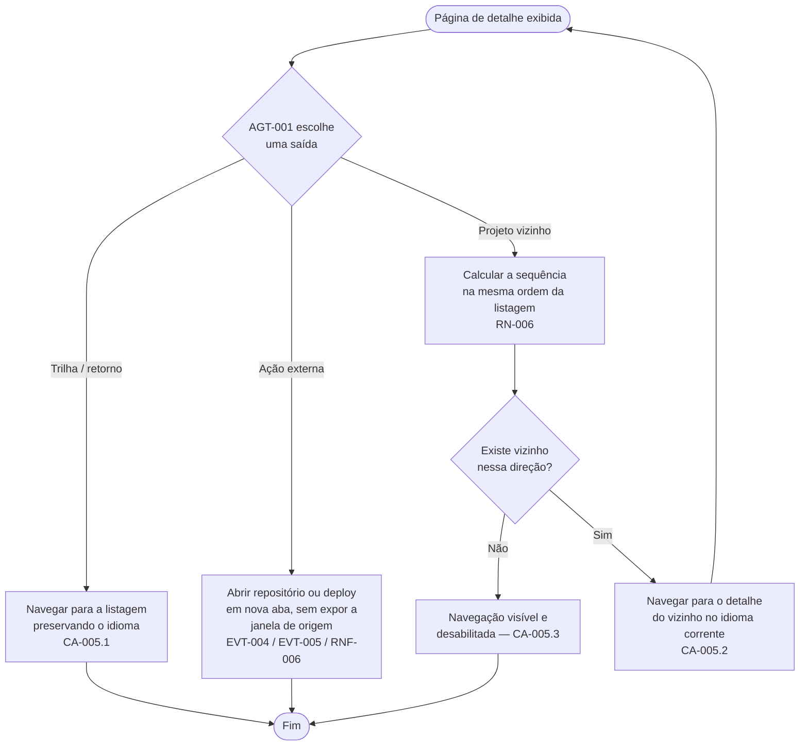
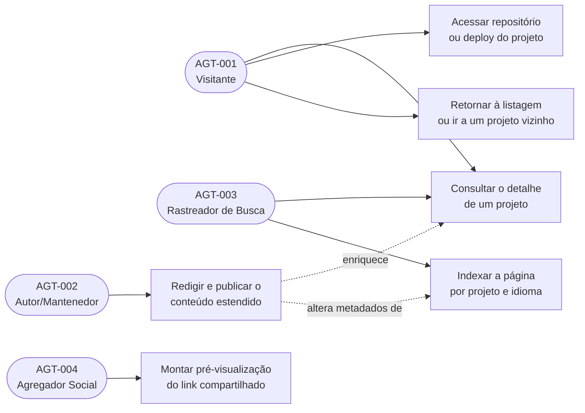

# Especificação de Requisitos de Software (ERS)

**Projeto:** Portfólio Arthur.Correa — Módulo Detalhe de Projeto
**Cliente/Órgão:** Arthur de Paula Correa (produto pessoal)
**Data:** 06/08/2026
**Versão:** 1.0

## Histórico de Revisões

| Versão | Data       | Autor                  | Descrição das Alterações                                                                                                                            |
| ------ | ---------- | ---------------------- | --------------------------------------------------------------------------------------------------------------------------------------------------- |
| 1.0    | 06/08/2026 | Arthur de Paula Correa | Criação do documento inicial do módulo Detalhe de Projeto: página pública por `slug` em `/{lang}/projects/{slug}`, com conteúdo estendido opcional. |

---

## 1. Introdução

_(Em conformidade com a norma ISO/IEC/IEEE 29148)_

### 1.1. Propósito do Documento

Este documento descreve as especificações de requisitos de software para o **módulo Detalhe de Projeto** do portfólio Arthur.Correa. O objetivo é fornecer uma visão clara, precisa e testável do comportamento esperado da página pública dedicada a um único projeto, servindo como base para as etapas de implementação, revisão e teste.

O módulo nasce de uma decisão registrada no módulo Projetos: o CTA "Ver Detalhes" do card passa a apontar para `/{lang}/projects/{slug}` (decisão QA-001, ver `docs/ers/projects.md`, versão 1.1). Aquele documento já registrava que uma página de detalhe seria "uma funcionalidade separada, com ERS e telas próprias" — este é esse documento.

Ele é derivado de `docs/mockups/project-detail.md`, cujas telas navegáveis foram construídas e validadas antes desta especificação.

### 1.2. Escopo do Produto

O módulo Detalhe de Projeto é a superfície pública que apresenta, em uma página própria, tudo o que o portfólio tem a dizer sobre um projeto específico. Ele não possui autenticação, formulários nem persistência: as informações são fatos estáticos declarados no repositório e renderizados no servidor.

O que o sistema fará:

- Publicar uma página pública por projeto cadastrado, endereçada pelo `slug` do próprio projeto, sob o segmento de locale.
- Apresentar, nessa página, os fatos do projeto — visual em 16:9, título, descrição, tecnologias, data de conclusão e links externos — e, quando existirem, o conteúdo estendido: texto longo, destaques técnicos e papel do autor.
- Comportar-se corretamente quando o projeto só possuir os fatos já exibidos no card da listagem, sem seção vazia nem título sem corpo.
- Responder "não encontrado" para um `slug` que não corresponda a nenhum projeto publicado e para um locale não suportado.
- Oferecer caminhos de saída: retorno à listagem e navegação para o projeto vizinho na mesma ordem da listagem.
- Expor metadados por projeto e por idioma para buscadores e para compartilhamento em redes.
- Estender a estrutura `Project` com campos de conteúdo estendido, todos opcionais, preservando integralmente os campos já existentes.

O que o sistema **NÃO** fará (Fora do Escopo):

- Não haverá galeria de múltiplas imagens, vídeo, carrossel ou captura de tela automatizada — nesta entrega não há nenhum ativo visual de projeto (decisão QA-002 do módulo Projetos).
- Não haverá comentários, curtidas, formulário de contato por projeto nem qualquer entrada de dados do visitante.
- Não haverá integração com a API do GitHub (estrelas, linguagens, último commit) nem qualquer consumo de serviço externo em tempo de requisição.
- Não haverá seção de "projetos relacionados" nesta entrega — ver QA-005 na Seção 2.2.
- Não haverá coleta de métricas de uso, analytics ou rastreamento de cliques.
- Não haverá edição de conteúdo por interface: a manutenção continua sendo feita editando `data/projects.ts` no repositório.

### 1.3. Agentes (AGT)

| ID      | Agente (AGT)        | Descrição                                                                                                                                                 | Nível de Acesso          |
| ------- | ------------------- | --------------------------------------------------------------------------------------------------------------------------------------------------------- | ------------------------ |
| AGT-001 | Visitante           | Pessoa que acessa publicamente a página de um projeto, vinda da listagem, de um link compartilhado ou de um resultado de busca.                           | Público, somente leitura |
| AGT-002 | Autor/Mantenedor    | Responsável por redigir o conteúdo estendido de cada projeto e mantê-lo em `data/projects.ts`. Único agente capaz de fazer uma página de detalhe existir. | Acesso ao repositório    |
| AGT-003 | Rastreador de Busca | Robô de indexação (Google, Bing) que percorre as páginas de detalhe para indexá-las individualmente.                                                      | Público, somente leitura |
| AGT-004 | Agregador Social    | Serviço que resolve a URL compartilhada para montar a pré-visualização do link (Open Graph / cartões de rede social).                                     | Público, somente leitura |

### 1.4. Definições, Acrônimos e Abreviações

| Termo/Acrônimo        | Definição                                                                                                              |
| --------------------- | ---------------------------------------------------------------------------------------------------------------------- |
| ERS                   | Especificação de Requisitos de Software.                                                                               |
| Projeto               | Trabalho desenvolvido pelo autor, descrito por um conjunto fixo de fatos declarados em `data/projects.ts`.             |
| Slug                  | Identificador textual estável e único de um projeto, em kebab-case. É o que endereça a página de detalhe.              |
| Conteúdo estendido    | Campos que existem apenas para a página de detalhe: texto longo, destaques técnicos e papel do autor. Todos opcionais. |
| Ficha do projeto      | Painel lateral que resume os fatos objetivos do projeto: data de conclusão, papel e tecnologias.                       |
| Trilha de navegação   | Sequência de links que situa a página na hierarquia do site (Início / Projetos / projeto atual).                       |
| Locale                | Idioma resolvido pela rota (`en` ou `pt-BR`), declarado em `lib/i18n-config.ts`.                                       |
| Dicionário            | Arquivo por locale (`app/[lang]/dictionaries/*.json`) que contém todo texto de interface exibido ao visitante.         |
| Canônica              | URL declarada como endereço oficial de uma página, evitando que buscadores tratem variantes como conteúdo duplicado.   |
| Alternativa de idioma | Declaração que informa aos buscadores que a mesma página existe em outro idioma, sob outro segmento de locale.         |
| Open Graph            | Conjunto de metadados que define como um link aparece quando compartilhado em redes sociais e aplicativos de mensagem. |

### 1.5. Referências

- `docs/ers/projects.md` — ERS do módulo Projetos, origem da decisão QA-001 e fonte das regras RN-001 a RN-008 daquele módulo.
- `docs/mockups/project-detail.md` — documento de mockup deste módulo, insumo direto desta especificação.
- Telas navegáveis: `/mockups/project-detail/project-detail-page` e `/mockups/project-detail/project-detail-states`.
- Issue #19 — Módulo de Projetos: <https://github.com/ArthurProjectCorrea/portfolio/issues/19>
- `ARCHITECTURE.md` — convenções de i18n, nomenclatura e estrutura de diretórios do repositório.
- Normas aplicadas: ABNT NBR ISO/IEC/IEEE 12207, ABNT NBR ISO/IEC 25030, ISO/IEC/IEEE 29148.
- WCAG 2.1, Nível AA — critérios de acessibilidade adotados nos RNF.

---

## 2. Descrição Geral do Sistema

### 2.1. Perspectiva do Produto

O módulo Detalhe de Projeto não é um produto independente: é a continuação natural do módulo Projetos e depende dele em três frentes.

1. **A mesma fonte de fatos.** A página de detalhe lê exatamente a mesma estrutura `Project` de `data/projects.ts` que alimenta o card da listagem e os indicadores da página inicial. Nenhum identificador novo é criado: o `slug` que já existe é o que endereça a página.
2. **A continuidade da navegação.** O CTA "Ver Detalhes" do card é a origem primária do tráfego desta página, e a listagem é o destino primário de saída. A ordem de leitura da listagem (RN-004 de `docs/ers/projects.md`) é a mesma ordem usada na navegação entre projetos vizinhos, para que o visitante não perceba duas ordenações diferentes no mesmo produto.
3. **A infraestrutura de i18n.** A página vive sob o segmento de locale e todo texto de interface vem de dicionário. Apenas os fatos e o conteúdo estendido do projeto residem em `data/projects.ts`, sempre como registros por locale.

A diferença essencial em relação ao módulo Projetos está na **profundidade**: o card resume, a página aprofunda. Como hoje não existe nenhum conteúdo aprofundado escrito, este módulo foi desenhado para ser correto e publicável mesmo quando o único conteúdo disponível é o que o card já mostra — a riqueza é incremental, acrescentada projeto a projeto pelo AGT-002, sem exigir uma migração de dados.

### 2.2. Suposições e Dependências

**Suposições:**

- O visitante acessa a página por um navegador moderno, em telas a partir de 320px de largura, podendo chegar diretamente por link compartilhado sem ter passado pela listagem.
- O conteúdo dos projetos muda com baixa frequência e sempre por alteração de código, o que permite renderização estática de todas as páginas de detalhe no momento da construção do site.
- Os links externos (repositório e deploy) apontam para destinos públicos mantidos por terceiros; sua disponibilidade não é responsabilidade deste módulo.
- Nenhum dado pessoal do visitante é coletado, tratado ou armazenado por este módulo — ver Seção 4, RNF-007.
- O conjunto de projetos é da ordem de dezenas, o que torna viável gerar todas as páginas de detalhe antecipadamente.

**Dependências:**

- Depende de `data/projects.ts` como fonte única dos fatos e do conteúdo estendido.
- Depende do módulo Projetos: a rota `/{lang}/projects` precisa existir para que a trilha de navegação e o retorno à listagem tenham destino. Publicar este módulo sem aquele produziria links quebrados.
- Depende dos dicionários `en.json` e `pt-BR.json`, que devem receber as novas chaves na mesma alteração, sem divergência entre si.
- Depende de o AGT-002 redigir o conteúdo estendido para que a página vá além do que o card já mostra — dependência de conteúdo, não de construção (ver QA-002 abaixo).

**Questões em aberto que condicionam esta especificação.** Nenhuma delas bloqueia a construção do módulo; a primeira e a segunda condicionam o resultado percebido.

| ID     | Questão                                                                                                                       | Origem no mockup | Impacto                                                                                                                    | Padrão adotado neste documento                                                    |
| ------ | ----------------------------------------------------------------------------------------------------------------------------- | ---------------- | -------------------------------------------------------------------------------------------------------------------------- | --------------------------------------------------------------------------------- |
| QA-001 | A página de detalhe existe para todos os projetos cadastrados, ou apenas para os que possuem conteúdo estendido?              | Q-001            | Define se algum card da listagem pode ter o CTA "Ver Detalhes" apontando para uma página inexistente.                      | RN-002: existe para todos, sem exceção — nenhum CTA pode apontar para o vazio.    |
| QA-002 | O autor pretende redigir o conteúdo estendido (`longDescription`, `highlights`, `role`) do projeto `portfolio` nesta entrega? | Q-002            | **Bloqueante para o conteúdo, não para a construção.** Sem redação do autor, a única página real sai com os fatos do card. | RN-005 proíbe publicar texto não escrito pelo autor; RF-003 garante a degradação. |
| QA-003 | O conteúdo longo é texto simples em parágrafos, ou precisa de formatação rica (subtítulos, listas, código, links inline)?     | Q-003            | Formatação rica exigiria uma decisão de formato de autoria e um mecanismo de renderização.                                 | Schema-001: sequência de parágrafos de texto simples.                             |
| QA-004 | A navegação para projeto anterior/seguinte deve existir?                                                                      | Q-004            | É conveniente, mas separável do detalhe em si.                                                                             | RF-005 a especifica; RN-006 fixa sua ordem. Pendente de confirmação.              |
| QA-005 | Deve haver uma seção de "projetos relacionados" por tecnologia em comum?                                                      | Q-005            | Só faz sentido com mais projetos cadastrados; hoje há um.                                                                  | Declarada fora de escopo na Seção 1.2.                                            |
| QA-006 | A imagem de compartilhamento social por projeto é a imagem padrão do site, ou gerada a partir do título e das tecnologias?    | Q-006            | Afeta a aparência do link compartilhado, não a página.                                                                     | RF-006: imagem padrão do site, coerente com a ausência de ativos por projeto.     |
| QA-007 | A ficha do projeto deve exibir algum fato além de data de conclusão, papel e tecnologias?                                     | Q-007            | Qualquer campo novo exigiria um fato real correspondente para cada projeto.                                                | RF-002: os três campos atuais.                                                    |

---

## 3. Requisitos Funcionais (RF) e Critérios de Aceite (CA)

_(O que o sistema deve fazer. Baseado na ABNT NBR ISO/IEC/IEEE 12207)_

### Módulo: Detalhe de Projeto

#### RF-001: Página Pública por Projeto

- **Descrição:** O sistema deve publicar, para cada projeto cadastrado, uma página pública endereçada pelo `slug` do projeto sob o segmento de locale, no formato `/{lang}/projects/{slug}`. Todas essas páginas devem ser produzidas antecipadamente, sem depender de processamento em tempo de requisição, e devem existir em todos os idiomas suportados. Um endereço cujo `slug` não corresponda a nenhum projeto publicado, ou cujo segmento de locale não corresponda a nenhum idioma suportado, deve resultar em resposta "não encontrado".
- **Agente(s) (AGT):** AGT-001 — Visitante; AGT-003 — Rastreador de Busca
- **Regras de Negócio Associadas:** RN-001, RN-002, RN-003
- **Eventos Disparados (EVT):** EVT-001, EVT-002, EVT-003
- **Schema de Dados de Entrada/Saída:** Schema-001

**Critérios de Aceite (CA):**

- **CA-001.1 — Acesso a projeto existente**
  - Dado que existe um projeto cadastrado com determinado identificador
  - Quando o agente AGT-001 acessa o endereço correspondente a esse identificador em um idioma suportado
  - Então o sistema deve exibir a página de detalhe daquele projeto, com o conteúdo no idioma da rota.
- **CA-001.2 — Cobertura de todos os projetos**
  - Dado o conjunto de projetos cadastrados
  - Quando o site é construído
  - Então deve existir uma página de detalhe para cada projeto e para cada idioma suportado, sem exceção.
- **CA-001.3 — Identificador inexistente**
  - Dado que o agente AGT-001 acessa um endereço cujo identificador não corresponde a nenhum projeto publicado
  - Quando a página tenta ser resolvida
  - Então o sistema deve responder "não encontrado", sem exibir conteúdo de outro projeto e sem redirecionar silenciosamente para a listagem.
- **CA-001.4 — Locale não suportado**
  - Dado que o agente AGT-001 acessa a página de um projeto existente com um segmento de locale desconhecido
  - Quando a página tenta ser resolvida
  - Então o sistema deve responder "não encontrado", sem exibir conteúdo em outro idioma.
- **CA-001.5 — Acesso direto sem passar pela listagem**
  - Dado que o agente AGT-001 abre a página a partir de um link compartilhado
  - Quando a página é exibida
  - Então ela deve ser compreensível por si só, apresentando trilha de navegação e retorno à listagem sem depender de histórico de navegação anterior.

#### RF-002: Apresentação do Conteúdo do Projeto

- **Descrição:** O sistema deve apresentar, na página de detalhe: trilha de navegação situando a página; área visual em proporção 16:9; título do projeto como cabeçalho principal da página; descrição de abertura; linha de ações externas; corpo textual sobre o projeto; lista de destaques técnicos; e uma ficha com data de conclusão, papel do autor e tecnologias empregadas. Projetos marcados como destaque devem exibir o selo correspondente sobre a área visual. Como não há ativo visual de projeto nesta entrega, a área visual deve exibir o substituto gráfico especificado no módulo Projetos.
- **Agente(s) (AGT):** AGT-001 — Visitante
- **Regras de Negócio Associadas:** RN-001, RN-004, RN-007, RN-008
- **Eventos Disparados (EVT):** EVT-001
- **Schema de Dados de Entrada/Saída:** Schema-001, Schema-002

**Critérios de Aceite (CA):**

- **CA-002.1 — Página completa**
  - Dado um projeto com conteúdo estendido, tecnologias, repositório e deploy
  - Quando a página é exibida
  - Então devem aparecer, nesta ordem: trilha de navegação, visual 16:9, título, descrição de abertura, ações externas, corpo textual, destaques técnicos e ficha do projeto.
- **CA-002.2 — Ausência de ativo visual**
  - Dado que nenhum projeto possui ativo visual nesta entrega
  - Quando a página é exibida
  - Então a área visual deve apresentar o substituto gráfico na proporção 16:9, com texto alternativo vindo do dicionário, jamais um espaço vazio ou uma área de altura indefinida.
- **CA-002.3 — Único cabeçalho principal**
  - Dado que a página é exibida
  - Quando sua estrutura de cabeçalhos é inspecionada
  - Então deve haver exatamente um cabeçalho principal, correspondente ao título do projeto, e as seções internas devem usar cabeçalhos de nível imediatamente inferior, em ordem, sem salto de nível.
- **CA-002.4 — Ficha do projeto**
  - Dado um projeto com data de conclusão, papel e tecnologias
  - Quando a página é exibida em uma janela de largura igual ou superior a 1024px
  - Então a ficha deve ser apresentada em coluna lateral, acompanhando a rolagem do conteúdo, e deve passar a integrar o fluxo vertical em larguras inferiores.
- **CA-002.5 — Projeto em destaque**
  - Dado um projeto marcado como destaque
  - Quando a página é exibida
  - Então o selo de destaque deve aparecer sobre a área visual, com o rótulo vindo do dicionário.
- **CA-002.6 — Conteúdo no idioma da rota**
  - Dado que o agente AGT-001 acessa a página com o locale `en`
  - Quando a página é exibida
  - Então os rótulos de interface devem estar em inglês e a descrição, o corpo textual, os destaques e o papel devem corresponder à variante `en` do próprio projeto.

#### RF-003: Degradação Graciosa sem Conteúdo Estendido

- **Descrição:** O sistema deve apresentar uma página correta e completa para projetos que possuam apenas os fatos já exibidos no card da listagem. Quando o corpo textual longo não existir, a seção "sobre o projeto" deve apresentar a descrição do projeto em seu lugar. Quando os destaques técnicos não existirem, a seção inteira — incluindo seu título — deve ser omitida. Quando o papel do autor não existir, a respectiva linha da ficha deve ser omitida. Em nenhuma hipótese a página deve exibir título de seção sem corpo, área em branco, texto genérico de preenchimento ou falhar por ausência de campo opcional.
- **Agente(s) (AGT):** AGT-001 — Visitante
- **Regras de Negócio Associadas:** RN-004, RN-005
- **Eventos Disparados (EVT):** EVT-001
- **Schema de Dados de Entrada/Saída:** Schema-001

**Critérios de Aceite (CA):**

- **CA-003.1 — Projeto apenas com os fatos do card**
  - Dado um projeto sem corpo textual longo, sem destaques técnicos e sem papel definido
  - Quando a página é exibida
  - Então ela deve apresentar trilha, visual, título, descrição, ações, ficha com data e tecnologias, e a seção "sobre o projeto" preenchida com a descrição do projeto, sem qualquer seção vazia e sem erro.
- **CA-003.2 — Destaques ausentes**
  - Dado um projeto sem destaques técnicos
  - Quando a página é exibida
  - Então nem o título da seção de destaques nem qualquer lista vazia devem aparecer.
- **CA-003.3 — Papel ausente**
  - Dado um projeto sem papel definido
  - Quando a ficha é exibida
  - Então a linha correspondente ao papel deve ser omitida, mantendo as demais linhas alinhadas.
- **CA-003.4 — Acréscimo incremental de conteúdo**
  - Dado um projeto publicado apenas com os fatos do card
  - Quando o AGT-002 acrescenta corpo textual e destaques a esse projeto
  - Então as seções correspondentes devem passar a ser exibidas na construção seguinte, sem exigir alteração em nenhum outro projeto.

#### RF-004: Ações Externas do Projeto

- **Descrição:** O sistema deve oferecer, na página de detalhe, ações de navegação para o repositório de código e para o ambiente publicado do projeto, com rótulos vindos do dicionário. Ambas devem abrir o destino externo em nova aba, protegidas contra manipulação da janela de origem. Quando o projeto não possuir a URL correspondente, a ação deve permanecer visível e inoperante, e ser anunciada como indisponível por leitores de tela.
- **Agente(s) (AGT):** AGT-001 — Visitante
- **Regras de Negócio Associadas:** RN-008
- **Eventos Disparados (EVT):** EVT-004, EVT-005
- **Schema de Dados de Entrada/Saída:** Schema-001

**Critérios de Aceite (CA):**

- **CA-004.1 — Acesso ao repositório**
  - Dado um projeto que possui URL de repositório
  - Quando o agente AGT-001 aciona a ação de repositório
  - Então o repositório deve ser aberto em nova aba, mantendo a página de detalhe intacta na aba de origem.
- **CA-004.2 — Acesso ao deploy**
  - Dado um projeto que possui URL de ambiente publicado
  - Quando o agente AGT-001 aciona a ação de deploy
  - Então o ambiente publicado deve ser aberto em nova aba, sob as mesmas condições.
- **CA-004.3 — Ação sem destino**
  - Dado um projeto sem URL de repositório
  - Quando a página é exibida
  - Então a ação de repositório deve aparecer em estado desabilitado, ser inoperante ao acionamento e ser anunciada como indisponível por leitores de tela.
- **CA-004.4 — Projeto sem nenhum link externo**
  - Dado um projeto sem repositório e sem deploy
  - Quando a página é exibida
  - Então ambas as ações devem aparecer desabilitadas, e o restante da página deve permanecer plenamente utilizável.

#### RF-005: Saídas da Página

- **Descrição:** O sistema deve oferecer caminhos de saída explícitos a partir da página de detalhe: a trilha de navegação, que leva à página inicial e à listagem de projetos; um retorno direto à listagem ao final do conteúdo; e a navegação para o projeto imediatamente anterior e o imediatamente seguinte, segundo a mesma ordem aplicada na listagem. Nas extremidades da sequência, a navegação indisponível deve permanecer visível e inoperante. Toda saída interna preserva o idioma corrente.
- **Agente(s) (AGT):** AGT-001 — Visitante
- **Regras de Negócio Associadas:** RN-003, RN-006, RN-008
- **Eventos Disparados (EVT):** EVT-006
- **Schema de Dados de Entrada/Saída:** Schema-001, Schema-002

**Critérios de Aceite (CA):**

- **CA-005.1 — Retorno à listagem**
  - Dado que o agente AGT-001 está na página de um projeto no idioma `pt-BR`
  - Quando aciona o retorno à listagem
  - Então deve chegar à listagem de projetos no mesmo idioma, sem passar por outro idioma no caminho.
- **CA-005.2 — Navegação entre projetos vizinhos**
  - Dado um projeto que não é o primeiro nem o último na ordem da listagem
  - Quando o agente AGT-001 aciona a navegação para o projeto seguinte
  - Então deve chegar à página de detalhe do projeto que o sucede naquela mesma ordem, no idioma corrente.
- **CA-005.3 — Extremidades da sequência**
  - Dado o primeiro projeto na ordem da listagem
  - Quando a página é exibida
  - Então a navegação para o projeto anterior deve aparecer desabilitada e inoperante.
- **CA-005.4 — Projeto único cadastrado**
  - Dado que existe exatamente um projeto cadastrado
  - Quando sua página de detalhe é exibida
  - Então as duas navegações entre vizinhos devem aparecer desabilitadas, e o retorno à listagem deve permanecer disponível.
- **CA-005.5 — Saída a partir de projeto não encontrado**
  - Dado que o agente AGT-001 acessou um endereço sem projeto correspondente
  - Quando a resposta "não encontrado" é exibida
  - Então ela deve apresentar explicação no idioma da rota e um caminho de retorno à listagem, nunca um beco sem saída.

#### RF-006: Metadados por Projeto

- **Descrição:** O sistema deve expor, para cada página de detalhe, metadados próprios e por idioma: título da página composto a partir do nome do projeto, descrição derivada da descrição do projeto no idioma da rota, endereço canônico da própria página, declaração das alternativas de idioma da mesma página, e metadados de compartilhamento social usando a imagem padrão do site. O conteúdo textual da página deve estar presente no documento entregue pelo servidor, sem depender de execução no navegador para ser lido por rastreadores.
- **Agente(s) (AGT):** AGT-003 — Rastreador de Busca; AGT-004 — Agregador Social
- **Regras de Negócio Associadas:** RN-003, RN-009
- **Eventos Disparados (EVT):** EVT-007
- **Schema de Dados de Entrada/Saída:** Schema-001, Schema-002

**Critérios de Aceite (CA):**

- **CA-006.1 — Título e descrição por projeto**
  - Dado que o agente AGT-003 acessa a página de um projeto
  - Quando lê os metadados do documento
  - Então o título deve conter o nome do projeto e a descrição deve corresponder à descrição daquele projeto no idioma da rota — nunca o título ou a descrição genéricos da listagem.
- **CA-006.2 — Canônica e alternativas de idioma**
  - Dado que a mesma página existe em todos os idiomas suportados
  - Quando o agente AGT-003 lê os metadados de uma delas
  - Então deve encontrar o endereço canônico da própria página e a declaração da variante equivalente em cada outro idioma suportado.
- **CA-006.3 — Compartilhamento social**
  - Dado que o agente AGT-004 resolve o endereço de uma página de detalhe
  - Quando monta a pré-visualização do link
  - Então deve obter título, descrição e imagem padrão do site, produzindo um cartão íntegro mesmo sem ativo visual próprio do projeto.
- **CA-006.4 — Conteúdo legível sem execução no navegador**
  - Dado que o agente AGT-003 requisita a página
  - Quando analisa o documento recebido
  - Então título, descrição, corpo textual, destaques e tecnologias devem estar presentes no próprio documento.

#### RF-007: Extensão Compatível da Estrutura de Projeto

- **Descrição:** O sistema deve estender a estrutura `Project` com os campos de conteúdo estendido necessários à página de detalhe — corpo textual longo, destaques técnicos e papel do autor, todos registros por locale e todos opcionais — preservando integralmente os campos já existentes, inclusive os acrescentados pelo módulo Projetos, e o funcionamento dos indicadores do site que os consomem.
- **Agente(s) (AGT):** AGT-002 — Autor/Mantenedor
- **Regras de Negócio Associadas:** RN-001, RN-005, RN-007
- **Eventos Disparados (EVT):** EVT-008
- **Schema de Dados de Entrada/Saída:** Schema-001

**Critérios de Aceite (CA):**

- **CA-007.1 — Compatibilidade retroativa**
  - Dado o projeto já cadastrado antes desta entrega, sem nenhum campo de conteúdo estendido
  - Quando sua página de detalhe é exibida
  - Então ela deve ser apresentada normalmente, no cenário de degradação graciosa de RF-003, sem erro de validação.
- **CA-007.2 — Indicadores preservados**
  - Dado que a estrutura foi estendida
  - Quando os indicadores da página inicial são calculados
  - Então a contagem de projetos e a contagem de tecnologias devem continuar produzindo os mesmos resultados que produziriam antes da extensão, para os mesmos dados.
- **CA-007.3 — Completude por idioma**
  - Dado que o AGT-002 preenche um campo de conteúdo estendido em apenas um dos idiomas suportados
  - Quando o conteúdo é submetido
  - Então a situação deve ser detectada antes da publicação, impedindo que a página apareça parcialmente traduzida.

---

## 4. Requisitos Não Funcionais (RNF)

_(Como o sistema deve se comportar. Baseado na ABNT NBR ISO/IEC 25030 e SQuaRE 25000)_

| ID      | Categoria           | Descrição do Requisito                                                                                         | Métrica/Critério de Teste                                                                                                                                        |
| ------- | ------------------- | -------------------------------------------------------------------------------------------------------------- | ---------------------------------------------------------------------------------------------------------------------------------------------------------------- |
| RNF-001 | Desempenho          | Cada página de detalhe deve ser entregue pronta, sem processamento em tempo de requisição.                     | Todas as páginas são produzidas na construção do site; Largest Contentful Paint ≤ 2,5s em conexão 4G simulada.                                                   |
| RNF-002 | Desempenho          | O crescimento do número de projetos não pode degradar o tempo de construção de forma desproporcional.          | O tempo de construção cresce linearmente com o número de projetos multiplicado pelo número de idiomas suportados.                                                |
| RNF-003 | Usabilidade         | A página deve ser utilizável em telas a partir de 320px de largura.                                            | Ausência de rolagem horizontal e de sobreposição de elementos entre 320px e 1920px.                                                                              |
| RNF-004 | Usabilidade         | O corpo textual deve manter medida de leitura confortável em telas largas.                                     | A largura da linha de texto permanece entre 45 e 75 caracteres em qualquer largura de janela.                                                                    |
| RNF-005 | Acessibilidade      | A página deve estar em conformidade com a WCAG 2.1, Nível AA.                                                  | Contraste mínimo de 4,5:1 para texto, hierarquia de cabeçalhos sem salto de nível, navegação completa por teclado, foco visível e imagens com texto alternativo. |
| RNF-006 | Segurança           | Links para destinos externos não podem expor a janela de origem ao site de destino.                            | Toda âncora com destino externo abre em nova aba com a relação de link que impede o acesso à janela de origem.                                                   |
| RNF-007 | Privacidade/LGPD    | O módulo não coleta, trata nem transmite dados pessoais do visitante.                                          | Verificação de que a rota não define cookies, não usa armazenamento local e não realiza requisições a terceiros durante a renderização.                          |
| RNF-008 | Manutenibilidade    | Enriquecer a página de um projeto deve exigir a alteração de um único arquivo de dados.                        | Acrescentar corpo textual e destaques a uma entrada de `data/projects.ts` reflete na página correspondente sem tocar em outro arquivo.                           |
| RNF-009 | Internacionalização | Nenhum texto de interface pode existir como literal dentro de componente.                                      | Toda chave nova existe em `en.json` e em `pt-BR.json`, com estruturas idênticas; a ausência em um dos arquivos é considerada defeito.                            |
| RNF-010 | Compatibilidade     | A extensão da estrutura de dados não pode quebrar consumidores existentes.                                     | A verificação de tipos do projeto conclui sem erros e as funções de `lib/site-stats.ts` permanecem inalteradas.                                                  |
| RNF-011 | SEO                 | Cada página de detalhe deve ser indexável individualmente e não competir com as demais por conteúdo duplicado. | Cada página declara canônica própria e alternativas de idioma; nenhuma delas repete o título ou a descrição da listagem.                                         |
| RNF-012 | Confiabilidade      | Um endereço inválido nunca deve produzir erro de servidor.                                                     | Requisições a identificadores inexistentes respondem "não encontrado" com página tratada, e não com falha de execução.                                           |

---

## 5. Regras de Negócio (RN)

| ID     | Título da Regra                             | Descrição                                                                                                                                                                                                                                                                                        |
| ------ | ------------------------------------------- | ------------------------------------------------------------------------------------------------------------------------------------------------------------------------------------------------------------------------------------------------------------------------------------------------ |
| RN-001 | Fonte única dos fatos do projeto            | Os fatos e o conteúdo estendido de um projeto residem exclusivamente em `data/projects.ts`. A página de detalhe não introduz nova fonte de dados, nova estrutura paralela nem duplicação de conteúdo. Equivale, e se subordina, à RN-001 de `docs/ers/projects.md`.                              |
| RN-002 | Toda página de card tem página de detalhe   | Existe uma página de detalhe para todo projeto cadastrado, sem condição de elegibilidade. Nenhum card da listagem pode exibir a ação "Ver Detalhes" apontando para um endereço que não resolve.                                                                                                  |
| RN-003 | Endereçamento pelo identificador existente  | A página é endereçada pelo `slug` já usado em `data/projects.ts`, sob o segmento de locale. Nenhum identificador novo é criado, e o `slug` é tratado como estável: alterá-lo quebra links já compartilhados e indexados, e por isso é uma decisão de conteúdo, não de implementação.             |
| RN-004 | Profundidade opcional, correção obrigatória | O conteúdo estendido é opcional em cada projeto, mas a correção da página não é. Uma página sem conteúdo estendido é um resultado legítimo e publicável, não um estado de erro nem um estado provisório.                                                                                         |
| RN-005 | Veracidade do conteúdo                      | Nenhum texto, destaque, papel, resultado ou métrica pode ser publicado sem corresponder a um trabalho realmente executado pelo autor e sem ter sido redigido por ele. Os rascunhos e entradas de exemplo das telas de mockup existem apenas ali e não podem ser promovidos a `data/projects.ts`. |
| RN-006 | Ordem única em todo o produto               | A sequência usada na navegação entre projetos vizinhos é exatamente a mesma ordem aplicada na listagem (RN-004 de `docs/ers/projects.md`: destaques primeiro, depois data de conclusão decrescente). O produto nunca apresenta duas ordenações diferentes para o mesmo conjunto de projetos.     |
| RN-007 | Conteúdo completo por idioma                | Todo campo de texto de um projeto — descrição, corpo textual, destaques e papel — existe em todos os idiomas suportados ou em nenhum. Não se publica página parcialmente traduzida, nem se recorre a outro idioma como substituto.                                                               |
| RN-008 | Continuidade com a listagem                 | Rótulos, comportamento das ações externas e tratamento de ações sem destino seguem o já definido no módulo Projetos (RN-003 e RN-005 de `docs/ers/projects.md`), para que o visitante não perceba dois vocabulários ou dois comportamentos distintos entre o card e a página.                    |
| RN-009 | Identidade própria de cada página           | Cada página de detalhe se apresenta a buscadores e agregadores com título, descrição e endereço canônico próprios, derivados do projeto. Nenhuma delas se apresenta com os metadados da listagem, sob pena de competirem entre si por conteúdo duplicado.                                        |

---

## 6. Eventos do Sistema (EVT)

Este módulo é uma superfície pública de leitura, sem sessão, sem persistência e sem processamento assíncrono. Os eventos abaixo são, portanto, ocorrências de renderização e de navegação — não geram registro em log, notificação nem efeito colateral em outro sistema.

| ID      | Evento (EVT)                          | Gatilho (O que causa o evento)                                                                              | Ação / Consequência                                                                                                                                  |
| ------- | ------------------------------------- | ----------------------------------------------------------------------------------------------------------- | ---------------------------------------------------------------------------------------------------------------------------------------------------- |
| EVT-001 | Renderização do Detalhe               | AGT-001 ou AGT-003 requisita a página de um projeto existente em um locale suportado.                       | O sistema resolve o projeto pelo identificador e entrega a página com os fatos, o conteúdo estendido disponível e os textos do dicionário do locale. |
| EVT-002 | Identificador Não Resolvido           | A página é requisitada com um identificador que não corresponde a nenhum projeto publicado.                 | O sistema responde "não encontrado", com explicação no idioma da rota e retorno à listagem (CA-001.3, CA-005.5).                                     |
| EVT-003 | Locale Não Suportado                  | A página é requisitada com um segmento de locale desconhecido.                                              | O sistema responde "não encontrado", sem exibir conteúdo em outro idioma (CA-001.4).                                                                 |
| EVT-004 | Saída para Repositório Externo        | AGT-001 aciona a ação de repositório em um projeto que possui repositório.                                  | Abre o repositório em nova aba, sem expor a janela de origem (RNF-006). A página permanece intacta.                                                  |
| EVT-005 | Saída para Ambiente Publicado         | AGT-001 aciona a ação de deploy em um projeto que possui deploy.                                            | Abre o ambiente publicado em nova aba, sob as mesmas condições de EVT-004.                                                                           |
| EVT-006 | Navegação Interna a partir do Detalhe | AGT-001 aciona a trilha de navegação, o retorno à listagem ou a navegação para um projeto vizinho.          | O sistema navega para o destino interno correspondente, preservando o idioma corrente (RF-005).                                                      |
| EVT-007 | Resolução de Pré-visualização         | AGT-004 resolve o endereço da página para montar o cartão de compartilhamento.                              | O sistema entrega título, descrição e imagem padrão do site nos metadados de compartilhamento (RF-006).                                              |
| EVT-008 | Enriquecimento de Projeto             | AGT-002 acrescenta ou altera conteúdo estendido de uma entrada em `data/projects.ts` e publica a alteração. | Na próxima construção do site, a página daquele projeto passa a exibir as seções correspondentes, sem afetar as páginas dos demais projetos.         |

---

## 7. Schemas de Dados (Estruturação)

### Schema-001: Projeto com Conteúdo Estendido

**Descrição:** Estrutura de um projeto exibido na página de detalhe. Corresponde à interface `Project` de `data/projects.ts`, já estendida pelo módulo Projetos com `image` e `featured` (ver Schema-001 de `docs/ers/projects.md`), e **estendida novamente** por este módulo com três campos opcionais de conteúdo estendido. Os campos preexistentes são preservados em nome, tipo e semântica (RN-001, CA-007.1). **Formato:** JSON (representação da estrutura tipada em TypeScript)

```json
{
  "$schema": "http://json-schema.org/draft-07/schema#",
  "title": "ProjetoDetalhado",
  "type": "object",
  "properties": {
    "slug": {
      "type": "string",
      "pattern": "^[a-z0-9]+(-[a-z0-9]+)*$",
      "description": "Identificador estável e único do projeto, em kebab-case. Campo existente — endereça a página de detalhe (RN-003) e não deve ser alterado após a publicação."
    },
    "title": {
      "type": "string",
      "minLength": 1,
      "maxLength": 80,
      "description": "Nome do projeto. Nome próprio: não é traduzido por locale. Compõe o título da página (RF-006)."
    },
    "description": {
      "type": "object",
      "description": "Descrição curta por locale. Usada como abertura da página e como descrição nos metadados; também é o corpo substituto quando não há texto longo (RF-003).",
      "properties": {
        "en": { "type": "string", "minLength": 1, "maxLength": 220 },
        "pt-BR": { "type": "string", "minLength": 1, "maxLength": 220 }
      },
      "required": ["en", "pt-BR"],
      "additionalProperties": false
    },
    "technologies": {
      "type": "array",
      "minItems": 1,
      "items": { "type": "string", "minLength": 1 },
      "description": "Tecnologias empregadas. Exibidas na ficha do projeto. Campo existente — não renomear."
    },
    "repoUrl": {
      "type": "string",
      "format": "uri",
      "description": "URL pública do repositório. Ausente quando o código não é público — nesse caso a ação fica visível e desabilitada (CA-004.3)."
    },
    "liveUrl": {
      "type": "string",
      "format": "uri",
      "description": "URL do ambiente publicado. Ausente quando não há deploy público."
    },
    "completedAt": {
      "type": "string",
      "pattern": "^[0-9]{4}-(0[1-9]|1[0-2])$",
      "description": "Ano e mês de conclusão, no formato yyyy-MM. Exibido na ficha e base da ordem de navegação entre vizinhos (RN-006)."
    },
    "image": {
      "type": "string",
      "pattern": "^/",
      "description": "Campo do módulo Projetos. Caminho absoluto do ativo visual 16:9. Ausente em todos os projetos nesta entrega — aplica-se o substituto gráfico (CA-002.2)."
    },
    "featured": {
      "type": "boolean",
      "default": false,
      "description": "Campo do módulo Projetos. Antecipa o projeto na ordem e acrescenta o selo de destaque também na página de detalhe (CA-002.5)."
    },
    "longDescription": {
      "type": "object",
      "description": "Campo novo, opcional. Corpo textual do projeto por locale, como sequência de parágrafos de texto simples, sem formatação rica (QA-003). Ausente quando o autor ainda não escreveu — nesse caso aplica-se RF-003.",
      "properties": {
        "en": {
          "type": "array",
          "minItems": 1,
          "items": { "type": "string", "minLength": 1 }
        },
        "pt-BR": {
          "type": "array",
          "minItems": 1,
          "items": { "type": "string", "minLength": 1 }
        }
      },
      "required": ["en", "pt-BR"],
      "additionalProperties": false
    },
    "highlights": {
      "type": "object",
      "description": "Campo novo, opcional. Destaques técnicos por locale, como lista curta de afirmações verificáveis (RN-005). A seção inteira é omitida quando ausente (CA-003.2).",
      "properties": {
        "en": {
          "type": "array",
          "minItems": 1,
          "maxItems": 6,
          "items": { "type": "string", "minLength": 1, "maxLength": 160 }
        },
        "pt-BR": {
          "type": "array",
          "minItems": 1,
          "maxItems": 6,
          "items": { "type": "string", "minLength": 1, "maxLength": 160 }
        }
      },
      "required": ["en", "pt-BR"],
      "additionalProperties": false
    },
    "role": {
      "type": "object",
      "description": "Campo novo, opcional. Papel exercido pelo autor no projeto, por locale. A linha da ficha é omitida quando ausente (CA-003.3).",
      "properties": {
        "en": { "type": "string", "minLength": 1, "maxLength": 120 },
        "pt-BR": { "type": "string", "minLength": 1, "maxLength": 120 }
      },
      "required": ["en", "pt-BR"],
      "additionalProperties": false
    }
  },
  "required": ["slug", "title", "description", "technologies", "completedAt"],
  "additionalProperties": false
}
```

### Schema-002: Textos de Interface do Módulo

**Descrição:** Conjunto de chaves de dicionário exigido pela página de detalhe, acrescentado ao já definido pelo módulo Projetos. Deve existir com estrutura idêntica em `app/[lang]/dictionaries/en.json` e em `app/[lang]/dictionaries/pt-BR.json` (RNF-009). Nenhum destes textos pode residir em `data/projects.ts`. **Formato:** JSON

```json
{
  "$schema": "http://json-schema.org/draft-07/schema#",
  "title": "DicionarioDetalheDeProjeto",
  "type": "object",
  "properties": {
    "projectDetail": {
      "type": "object",
      "properties": {
        "metaTitleTemplate": {
          "type": "string",
          "description": "Modelo do título da página, com marcador para o nome do projeto."
        },
        "breadcrumbHome": {
          "type": "string",
          "description": "Rótulo do item inicial da trilha."
        },
        "breadcrumbProjects": {
          "type": "string",
          "description": "Rótulo do item de listagem na trilha."
        },
        "back": {
          "type": "string",
          "description": "Rótulo do retorno à listagem."
        },
        "previous": {
          "type": "string",
          "description": "Rótulo da navegação para o projeto anterior."
        },
        "next": {
          "type": "string",
          "description": "Rótulo da navegação para o próximo projeto."
        },
        "about": {
          "type": "string",
          "description": "Título da seção de corpo textual."
        },
        "highlights": {
          "type": "string",
          "description": "Título da seção de destaques técnicos."
        },
        "factSheet": {
          "type": "string",
          "description": "Título da ficha do projeto."
        },
        "completedAt": {
          "type": "string",
          "description": "Rótulo do campo de data de conclusão na ficha."
        },
        "role": {
          "type": "string",
          "description": "Rótulo do campo de papel na ficha."
        },
        "technologies": {
          "type": "string",
          "description": "Rótulo do campo de tecnologias na ficha."
        },
        "notFound": {
          "type": "object",
          "properties": {
            "title": { "type": "string" },
            "description": { "type": "string" }
          },
          "required": ["title", "description"]
        }
      },
      "required": [
        "metaTitleTemplate",
        "breadcrumbHome",
        "breadcrumbProjects",
        "back",
        "previous",
        "next",
        "about",
        "highlights",
        "factSheet",
        "completedAt",
        "role",
        "technologies",
        "notFound"
      ]
    }
  },
  "required": ["projectDetail"]
}
```

Os rótulos das ações externas (repositório e deploy), o rótulo do selo de destaque e o texto alternativo do substituto visual **não** são redeclarados aqui: são reaproveitados das chaves já definidas pelo módulo Projetos (Schema-002 de `docs/ers/projects.md`), em cumprimento à RN-008.

---

## 8. Requisitos de Interfaces Externas

### 8.1. Interfaces de Usuário (UI)

- A interface segue o sistema de componentes já vendorizado do repositório (`components/ui`, gerado via CLI do shadcn/ui sobre Base UI), com Tailwind CSS e tema claro/escuro dirigido pelo provedor global.
- Os componentes desta página são específicos da funcionalidade e pertencem à área de componentes privados do módulo; o substituto gráfico da área visual e o selo de destaque devem ser reaproveitados do módulo Projetos, e não reimplementados (RN-008).
- As decisões de layout — trilha de navegação, visual 16:9 com substituto gráfico, hierarquia de cabeçalhos, duas colunas com ficha fixa no desktop e coluna única em telas menores, medida de leitura do corpo textual, omissão de seções ausentes, estado de carregamento e estado de projeto não encontrado — foram validadas nas telas navegáveis descritas na Seção 10 e detalhadas em `docs/mockups/project-detail.md`.
- A ficha do projeto é apresentada como lista de definições, para que a relação entre rótulo e valor seja perceptível também por leitores de tela.

### 8.2. Interfaces de Software (APIs e Integrações)

Não aplicável a este módulo — a página é construída inteiramente a partir de dados estáticos versionados no repositório, sem consumir nem expor qualquer API. As únicas interfaces externas são hiperlinks de saída para o repositório e o ambiente publicado do projeto (EVT-004 e EVT-005), que não constituem integração: nenhum dado é trocado, nenhuma credencial é utilizada e a indisponibilidade do destino não afeta a página. Os metadados de compartilhamento (EVT-007) são consumidos por agregadores externos, mas de forma passiva — o sistema apenas os declara no documento entregue.

---

## 9. Matriz de Rastreabilidade de Requisitos

| ID Requisito | Agente (AGT)     | Regras de Negócio (RN)         | Eventos (EVT)             | Schema de Dados        | Critérios de Aceite (CA)                                   |
| ------------ | ---------------- | ------------------------------ | ------------------------- | ---------------------- | ---------------------------------------------------------- |
| RF-001       | AGT-001, AGT-003 | RN-001, RN-002, RN-003         | EVT-001, EVT-002, EVT-003 | Schema-001             | CA-001.1, CA-001.2, CA-001.3, CA-001.4, CA-001.5           |
| RF-002       | AGT-001          | RN-001, RN-004, RN-007, RN-008 | EVT-001                   | Schema-001, Schema-002 | CA-002.1, CA-002.2, CA-002.3, CA-002.4, CA-002.5, CA-002.6 |
| RF-003       | AGT-001          | RN-004, RN-005                 | EVT-001                   | Schema-001             | CA-003.1, CA-003.2, CA-003.3, CA-003.4                     |
| RF-004       | AGT-001          | RN-008                         | EVT-004, EVT-005          | Schema-001             | CA-004.1, CA-004.2, CA-004.3, CA-004.4                     |
| RF-005       | AGT-001          | RN-003, RN-006, RN-008         | EVT-006, EVT-002          | Schema-001, Schema-002 | CA-005.1, CA-005.2, CA-005.3, CA-005.4, CA-005.5           |
| RF-006       | AGT-003, AGT-004 | RN-003, RN-009                 | EVT-007                   | Schema-001, Schema-002 | CA-006.1, CA-006.2, CA-006.3, CA-006.4                     |
| RF-007       | AGT-002          | RN-001, RN-005, RN-007         | EVT-008                   | Schema-001             | CA-007.1, CA-007.2, CA-007.3                               |

---

## 10. Anexos e Modelos Visuais

### Anexo A — Fluxo principal de resolução e renderização da página

```mermaid
flowchart TD
    A([AGT-001 acessa /{lang}/projects/{slug}]) --> B{Locale do segmento<br/>é suportado?}
    B -- Não --> C[Responder 'não encontrado'<br/>EVT-003 / CA-001.4]
    B -- Sim --> D[Carregar dicionário do locale<br/>e ler data/projects.ts]
    D --> E{Existe projeto com<br/>esse identificador?}
    E -- Não --> F[Responder 'não encontrado'<br/>com retorno à listagem<br/>EVT-002 / CA-005.5]
    E -- Sim --> G[Renderizar trilha, visual 16:9<br/>com substituto gráfico, título<br/>e descrição de abertura<br/>RF-002]
    G --> H{Projeto está<br/>em destaque?}
    H -- Sim --> I[Exibir selo de destaque<br/>CA-002.5]
    H -- Não --> J[Sem selo]
    I --> K[Montar linha de ações externas<br/>RF-004]
    J --> K
    K --> L{Possui corpo<br/>textual longo?}
    L -- Sim --> M[Renderizar parágrafos<br/>na seção 'sobre o projeto']
    L -- Não --> N[Usar a descrição do projeto<br/>como corpo — CA-003.1]
    M --> O{Possui destaques<br/>técnicos?}
    N --> O
    O -- Sim --> P[Renderizar lista de destaques]
    O -- Não --> Q[Omitir a seção inteira<br/>CA-003.2]
    P --> R[Montar ficha do projeto:<br/>data, papel se houver,<br/>tecnologias — CA-002.4 / CA-003.3]
    Q --> R
    R --> S[Montar saídas: trilha, retorno<br/>à listagem e vizinhos<br/>RF-005]
    S --> T([Página entregue — EVT-001])
```

### Anexo B — Fluxo de saídas e navegação entre projetos



### Anexo C — Protótipos navegáveis

Diferentemente de um anexo estático, os protótipos deste módulo são telas reais e clicáveis, executadas pela própria aplicação:

- `/mockups/project-detail/project-detail-page` — anatomia completa da página, com alternância entre identificadores simulados e entre idiomas do conteúdo.
- `/mockups/project-detail/project-detail-states` — estados e exceções: conteúdo estendido, somente os fatos do card, projeto sem repositório, carregamento e identificador inexistente.
- Documentação correspondente: `docs/mockups/project-detail.md`.

Não há protótipo em ferramenta de design (Figma ou equivalente) para este módulo.

### Anexo D — Diagrama de casos de uso


