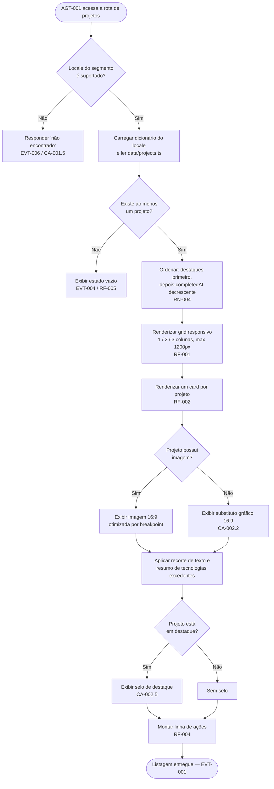
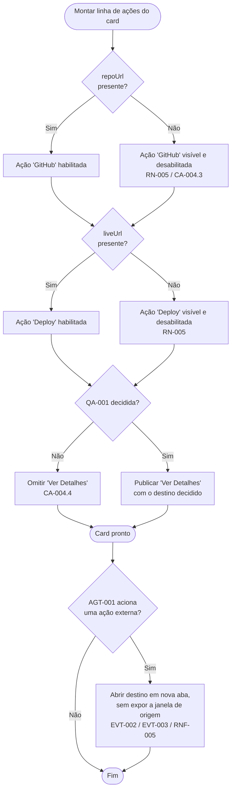
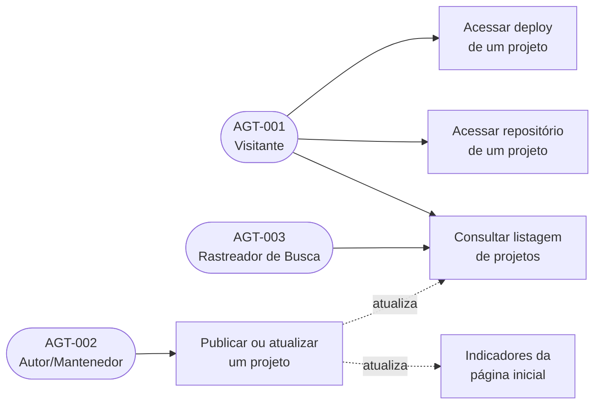

# Especificação de Requisitos de Software (ERS)

**Projeto:** Portfólio Arthur.Correa — Módulo Projetos
**Cliente/Órgão:** Arthur de Paula Correa (produto pessoal)
**Data:** 06/08/2026
**Versão:** 1.0

## Histórico de Revisões

| Versão | Data       | Autor                  | Descrição das Alterações                                                                                                                        |
| ------ | ---------- | ---------------------- | ----------------------------------------------------------------------------------------------------------------------------------------------- |
| 1.0    | 06/08/2026 | Arthur de Paula Correa | Criação do documento inicial do módulo Projetos: listagem pública em grid responsivo, card de projeto e extensão do schema `Project` existente. |

---

## 1. Introdução

_(Em conformidade com a norma ISO/IEC/IEEE 29148)_

### 1.1. Propósito do Documento

Este documento descreve as especificações de requisitos de software para o **módulo Projetos** do portfólio Arthur.Correa. O objetivo é fornecer uma visão clara, precisa e testável do comportamento esperado da listagem pública de projetos e do card que a compõe, servindo como base para as etapas de implementação, revisão e teste.

O documento é derivado da issue #19 (<https://github.com/ArthurProjectCorrea/portfolio/issues/19>) e do documento de mockup `docs/mockups/projects.md`, cujas telas navegáveis foram construídas e validadas antes desta especificação.

### 1.2. Escopo do Produto

O módulo Projetos é a superfície pública do portfólio responsável por apresentar, de forma navegável, os trabalhos desenvolvidos pelo autor. Ele não possui autenticação, formulários nem persistência: as informações são fatos estáticos declarados no repositório e renderizados no servidor.

O que o sistema fará:

- Exibir todos os projetos cadastrados em `data/projects.ts` em um grid responsivo (1 coluna em mobile, 2 em tablet, 3 em desktop), com largura máxima de 1200px centralizada.
- Apresentar cada projeto em um card contendo visual em proporção 16:9, título, descrição resumida, badges das tecnologias empregadas e ações de navegação externa.
- Aplicar realce visual (elevação e sobreposição escura) ao card sob interação de ponteiro, e realce equivalente por foco de teclado.
- Exibir os textos de interface no idioma resolvido pela rota, a partir dos dicionários por locale.
- Comportar-se corretamente quando não houver nenhum projeto cadastrado.
- Estender a estrutura `Project` já existente com os campos necessários ao card, preservando integralmente os campos hoje consumidos por outras partes do sistema.

O que o sistema **NÃO** fará (Fora do Escopo):

- Não haverá busca, filtro por tecnologia, ordenação escolhida pelo visitante ou paginação — nenhum deles foi solicitado.
- Não haverá cadastro, edição ou remoção de projetos por interface: a manutenção do conteúdo é feita editando `data/projects.ts` no repositório.
- Não haverá integração com a API do GitHub (contagem de estrelas, linguagens, último commit) nem qualquer consumo de serviço externo em tempo de requisição.
- Não haverá página de detalhe por projeto nesta entrega enquanto a questão QA-001 (Seção 2.2) não for decidida.
- Não haverá coleta de métricas de uso, analytics ou rastreamento de cliques nos CTAs.

### 1.3. Agentes (AGT)

| ID      | Agente (AGT)        | Descrição                                                                                                               | Nível de Acesso          |
| ------- | ------------------- | ----------------------------------------------------------------------------------------------------------------------- | ------------------------ |
| AGT-001 | Visitante           | Pessoa que acessa publicamente o portfólio para conhecer os trabalhos do autor. Único agente humano do módulo.          | Público, somente leitura |
| AGT-002 | Autor/Mantenedor    | Responsável por cadastrar e atualizar os projetos diretamente em `data/projects.ts` e por fornecer os ativos de imagem. | Acesso ao repositório    |
| AGT-003 | Rastreador de Busca | Robô de indexação (Google, Bing) que percorre a listagem para indexar o conteúdo público.                               | Público, somente leitura |

### 1.4. Definições, Acrônimos e Abreviações

| Termo/Acrônimo | Definição                                                                                                                            |
| -------------- | ------------------------------------------------------------------------------------------------------------------------------------ |
| ERS            | Especificação de Requisitos de Software.                                                                                             |
| Projeto        | Trabalho desenvolvido pelo autor, descrito por um conjunto fixo de fatos (título, descrição, tecnologias, links, data de conclusão). |
| Card           | Unidade visual que representa um projeto na listagem.                                                                                |
| Grid           | Arranjo em colunas que organiza os cards, com número de colunas variável conforme a largura da tela.                                 |
| Locale         | Idioma resolvido pela rota (`en` ou `pt-BR`), declarado em `lib/i18n-config.ts`.                                                     |
| Dicionário     | Arquivo por locale (`app/[lang]/dictionaries/*.json`) que contém todo texto de interface exibido ao visitante.                       |
| Slug           | Identificador textual estável e único de um projeto, em kebab-case.                                                                  |
| CTA            | _Call to action_ — elemento acionável do card ("Ver Detalhes", "GitHub", "Deploy").                                                  |
| Destaque       | Marcação opcional (`featured`) que sinaliza visualmente um projeto de maior relevância.                                              |

### 1.5. Referências

- Issue #19 — Módulo de Projetos: <https://github.com/ArthurProjectCorrea/portfolio/issues/19>
- `docs/mockups/projects.md` — documento de mockup do módulo, insumo direto desta especificação.
- Telas navegáveis: `/mockups/projects/projects-grid` e `/mockups/projects/project-card-states`.
- `ARCHITECTURE.md` — convenções de i18n, nomenclatura e estrutura de diretórios do repositório.
- `CURRICULUM.md` — fonte factual de tecnologias e trajetória profissional do autor.
- Normas aplicadas: ABNT NBR ISO/IEC/IEEE 12207, ABNT NBR ISO/IEC 25030, ISO/IEC/IEEE 29148.
- WCAG 2.1, Nível AA — critérios de acessibilidade adotados nos RNF.

---

## 2. Descrição Geral do Sistema

### 2.1. Perspectiva do Produto

O módulo Projetos não é um produto independente: ele é uma superfície do portfólio já existente e se apoia em três elementos que **antecedem** esta especificação.

1. **A estrutura de dados `Project`, já existente.** O arquivo `data/projects.ts` foi criado para a funcionalidade de métricas do site (issue #17) e hoje contém uma entrada. Sua interface atual declara `slug`, `title`, `description` (registro por locale), `technologies`, `repoUrl` opcional, `liveUrl` opcional e `completedAt`. Este módulo **estende** essa estrutura; não a substitui.
2. **O módulo de métricas do site.** `lib/site-stats.ts` consome `data/projects.ts` em `getProjectsCount()` (contagem de projetos) e `getTechnologiesCount()` (união das tecnologias de projetos e habilidades), e ambas alimentam os indicadores da seção inicial (`components/private/home/hero-section.tsx`). Qualquer renomeação de `slug`, `technologies` ou `completedAt` quebraria essas funções — daí a RN-002.
3. **A infraestrutura de i18n.** Toda rota do produto vive sob o segmento de locale e todo texto de interface vem de dicionário. O módulo Projetos não abre exceção: apenas os fatos do projeto (título, texto da descrição, nomes das tecnologias, URLs) permanecem em `data/projects.ts`, no mesmo padrão já adotado por `data/socials.ts` e `data/skills.ts`.

O esboço de estrutura de dados presente na issue #19 (`id` numérico, `description` como string única, objeto `links: { github, deploy }`) **não é compatível** com o que já existe e foi conscientemente reconciliado nesta especificação — ver RN-001, RN-002 e RN-003.

### 2.2. Suposições e Dependências

**Suposições:**

- O visitante acessa o portfólio por um navegador moderno, com ou sem apontador (mouse/touch), em telas a partir de 320px de largura.
- O conteúdo dos projetos muda com baixa frequência e sempre por alteração de código, o que permite renderização estática.
- Os links externos (repositório e deploy) apontam para destinos públicos mantidos por terceiros; sua disponibilidade não é responsabilidade deste módulo.
- Nenhum dado pessoal do visitante é coletado, tratado ou armazenado por este módulo — ver Seção 4, RNF-006.

**Dependências:**

- Depende de `data/projects.ts` como fonte única dos fatos dos projetos.
- Depende dos dicionários `en.json` e `pt-BR.json`, que devem receber as novas chaves na mesma alteração, sem divergência entre si.
- Depende do fornecimento de ativos de imagem pelo AGT-002 caso a decisão de QA-002 seja usar screenshots reais.

**Questões em aberto que condicionam esta especificação.** As três primeiras são bloqueantes para a implementação; as demais possuem um padrão adotado neste documento, mas devem ser confirmadas.

| ID     | Questão                                                                                                                                                                        | Origem no mockup | Impacto                                                                                                                      | Padrão adotado neste documento                                               |
| ------ | ------------------------------------------------------------------------------------------------------------------------------------------------------------------------------ | ---------------- | ---------------------------------------------------------------------------------------------------------------------------- | ---------------------------------------------------------------------------- |
| QA-001 | O CTA "Ver Detalhes" leva a uma página de detalhe por projeto (`/{lang}/projects/{slug}`), é removido desta entrega, ou vira atalho para o deploy/repositório?                 | Q-001            | **Bloqueante.** Uma página de detalhe é uma funcionalidade separada, com ERS e telas próprias — não pode ser inventada aqui. | RF-004 especifica o comportamento das três alternativas, sem eleger nenhuma. |
| QA-002 | Qual a origem das imagens 16:9: screenshots reais fornecidos pelo autor, gráficos genéricos gerados, ou nenhum visual até haver screenshots?                                   | Q-002            | **Bloqueante.** Não existe nenhum ativo de projeto em `public/` nem pipeline de captura de telas.                            | RF-002 exige o comportamento de ausência de imagem em qualquer cenário.      |
| QA-003 | Quais projetos reais devem povoar a listagem? `CURRICULUM.md` registra **vínculos empregatícios** (HPAR, Inovatus, DSS, CSF), não projetos publicáveis com repositório/deploy. | Q-003            | **Bloqueante para o conteúdo.** RN-006 proíbe inventar projetos; hoje só existe uma entrada real.                            | A listagem sai com os projetos reais existentes, sem fabricação.             |
| QA-004 | A listagem é rota própria, seção da home, ou ambas?                                                                                                                            | Q-004            | Define onde o módulo é montado. O cabeçalho já aponta para `/{lang}/projects`, hoje inexistente (404).                       | RF-001: rota própria, resolvendo o link quebrado do cabeçalho.               |
| QA-005 | Qual a regra de ordenação da listagem?                                                                                                                                         | Q-005            | Define a ordem de leitura da página.                                                                                         | RN-004: destaques primeiro, depois `completedAt` decrescente.                |
| QA-006 | CTAs sem URL correspondente ficam desabilitados ou ocultos?                                                                                                                    | Q-006            | Afeta o alinhamento entre cards vizinhos.                                                                                    | RN-005: desabilitados e visíveis.                                            |
| QA-007 | `featured` apenas destaca o card ou também altera sua posição/tamanho no grid?                                                                                                 | Q-007            | Afeta o layout do grid.                                                                                                      | RN-004: influencia ordem e selo, nunca o tamanho da célula.                  |

---

## 3. Requisitos Funcionais (RF) e Critérios de Aceite (CA)

_(O que o sistema deve fazer. Baseado na ABNT NBR ISO/IEC/IEEE 12207)_

### Módulo: Projetos

#### RF-001: Listagem de Projetos em Grid Responsivo

- **Descrição:** O sistema deve apresentar, em uma rota pública sob o segmento de locale, a listagem completa dos projetos cadastrados, organizada em um grid responsivo com uma coluna em telas pequenas, duas em telas médias e três em telas grandes, com espaçamento de 2rem entre células e largura máxima de 1200px centralizada. A listagem deve incluir um título e um subtítulo de seção, ambos provenientes do dicionário do locale resolvido.
- **Agente(s) (AGT):** AGT-001 — Visitante; AGT-003 — Rastreador de Busca
- **Regras de Negócio Associadas:** RN-001, RN-002, RN-004, RN-007
- **Eventos Disparados (EVT):** EVT-001
- **Schema de Dados de Entrada/Saída:** Schema-001

**Critérios de Aceite (CA):**

- **CA-001.1 — Listagem em desktop**
  - Dado que existem três ou mais projetos cadastrados
  - Quando o agente AGT-001 acessa a rota de projetos em uma janela de largura igual ou superior a 1024px
  - Então o sistema deve exibir todos os projetos em um grid de três colunas, com o conteúdo limitado a 1200px de largura e centralizado horizontalmente.
- **CA-001.2 — Adaptação a tablet**
  - Dado que o agente AGT-001 está na rota de projetos
  - Quando a largura da janela está entre 768px e 1023px
  - Então o grid deve exibir exatamente duas colunas, preservando o espaçamento entre células.
- **CA-001.3 — Adaptação a mobile**
  - Dado que o agente AGT-001 está na rota de projetos
  - Quando a largura da janela é inferior a 768px, até o mínimo de 320px
  - Então o grid deve exibir exatamente uma coluna, sem rolagem horizontal.
- **CA-001.4 — Textos de interface no idioma da rota**
  - Dado que o agente AGT-001 acessa a rota de projetos com o locale `en`
  - Quando a página é renderizada
  - Então o título da seção, o subtítulo e os rótulos dos CTAs devem ser exibidos em inglês, e a descrição de cada projeto deve corresponder à variante `en` do próprio projeto.
- **CA-001.5 — Locale desconhecido**
  - Dado que o agente AGT-001 acessa a rota de projetos com um segmento de locale que não corresponde a nenhum idioma suportado
  - Quando a página tenta ser renderizada
  - Então o sistema deve responder "não encontrado", sem exibir conteúdo em outro idioma.

#### RF-002: Apresentação do Card de Projeto

- **Descrição:** O sistema deve representar cada projeto por um card composto por: área visual em proporção 16:9 no topo, título, descrição resumida limitada a três linhas, conjunto de badges com as tecnologias empregadas e uma linha de ações. Quando o projeto não possuir imagem associada, a área visual deve exibir um recurso gráfico substituto que mantenha a mesma proporção, jamais um espaço vazio ou um card com altura diferente dos vizinhos. Quando o número de tecnologias exceder o limite exibível, o excedente deve ser resumido em um indicador numérico.
- **Agente(s) (AGT):** AGT-001 — Visitante
- **Regras de Negócio Associadas:** RN-001, RN-003, RN-005, RN-008
- **Eventos Disparados (EVT):** Nenhum
- **Schema de Dados de Entrada/Saída:** Schema-001

**Critérios de Aceite (CA):**

- **CA-002.1 — Card completo**
  - Dado um projeto com imagem, título, descrição, tecnologias, repositório e deploy
  - Quando o card é renderizado
  - Então o visual deve ocupar a proporção 16:9 no topo do card, e título, descrição, badges e a linha de ações devem aparecer nessa ordem, com os três CTAs habilitados.
- **CA-002.2 — Projeto sem imagem**
  - Dado um projeto cujo campo de imagem não está preenchido
  - Quando o card é renderizado
  - Então a área visual deve exibir o recurso gráfico substituto na mesma proporção 16:9, e o card deve manter a mesma altura dos demais cards da linha.
- **CA-002.3 — Texto excedente**
  - Dado um projeto cujo título ocupa mais de duas linhas e cuja descrição ocupa mais de três linhas
  - Quando o card é renderizado
  - Então o título deve ser recortado em duas linhas e a descrição em três, sem deslocar as badges nem a linha de ações em relação aos cards vizinhos.
- **CA-002.4 — Excedente de tecnologias**
  - Dado um projeto com mais tecnologias do que o limite exibível
  - Quando o card é renderizado
  - Então devem ser exibidas as badges até o limite, seguidas de um indicador com a quantidade restante.
- **CA-002.5 — Projeto em destaque**
  - Dado um projeto marcado como destaque
  - Quando o card é renderizado
  - Então deve ser exibido um selo de destaque sobre a área visual, com o rótulo vindo do dicionário, sem alterar as dimensões da célula do grid.

#### RF-003: Realce do Card sob Interação

- **Descrição:** O sistema deve realçar visualmente o card quando ele receber interação de ponteiro, combinando elevação (deslocamento vertical e sombra) com uma sobreposição escura sobre a área visual. O mesmo realce, ou um equivalente perceptível, deve ocorrer quando qualquer elemento interno do card receber foco de teclado, e o realce deve ser suprimido quando o visitante tiver declarado preferência por movimento reduzido.
- **Agente(s) (AGT):** AGT-001 — Visitante
- **Regras de Negócio Associadas:** RN-008
- **Eventos Disparados (EVT):** Nenhum
- **Schema de Dados de Entrada/Saída:** Não aplicável — o realce não consome nem produz dados.

**Critérios de Aceite (CA):**

- **CA-003.1 — Realce por ponteiro**
  - Dado que o agente AGT-001 está na listagem em um dispositivo com apontador
  - Quando posiciona o ponteiro sobre um card
  - Então o card deve ser elevado e uma sobreposição escura deve cobrir a área visual, com transição suave.
- **CA-003.2 — Retorno ao estado padrão**
  - Dado que um card está realçado
  - Quando o ponteiro deixa a área do card
  - Então o card deve retornar ao estado padrão sem deslocar os cards vizinhos.
- **CA-003.3 — Navegação por teclado**
  - Dado que o agente AGT-001 navega pela listagem usando a tecla Tab
  - Quando o foco entra em um elemento acionável de um card
  - Então o card correspondente deve apresentar realce perceptível e o elemento focado deve exibir indicador de foco visível.
- **CA-003.4 — Preferência por movimento reduzido**
  - Dado que o agente AGT-001 declarou preferência do sistema por movimento reduzido
  - Quando interage com um card
  - Então o realce deve ocorrer sem animação de deslocamento ou ampliação.

#### RF-004: Ações do Card

- **Descrição:** O sistema deve oferecer, em cada card, ações de navegação para o repositório de código e para o ambiente publicado do projeto, cujos rótulos vêm do dicionário. Ambas devem abrir o destino externo em nova aba, protegidas contra manipulação da janela de origem. Quando o projeto não possuir a URL correspondente, a ação deve permanecer visível e inoperante. A ação "Ver Detalhes" tem seu destino condicionado à decisão QA-001 da Seção 2.2 e, enquanto essa decisão não existir, o comportamento especificado é o de CA-004.4.
- **Agente(s) (AGT):** AGT-001 — Visitante
- **Regras de Negócio Associadas:** RN-003, RN-005
- **Eventos Disparados (EVT):** EVT-002, EVT-003
- **Schema de Dados de Entrada/Saída:** Schema-001

**Critérios de Aceite (CA):**

- **CA-004.1 — Acesso ao repositório**
  - Dado um projeto que possui URL de repositório
  - Quando o agente AGT-001 aciona a ação "GitHub"
  - Então o repositório deve ser aberto em nova aba, mantendo a listagem intacta na aba de origem.
- **CA-004.2 — Acesso ao deploy**
  - Dado um projeto que possui URL de ambiente publicado
  - Quando o agente AGT-001 aciona a ação "Deploy"
  - Então o ambiente publicado deve ser aberto em nova aba.
- **CA-004.3 — Ação sem destino**
  - Dado um projeto sem URL de repositório
  - Quando o card é renderizado
  - Então a ação "GitHub" deve aparecer em estado desabilitado, ser inoperante ao clique e ser anunciada como indisponível por leitores de tela.
- **CA-004.4 — Ver Detalhes com destino indefinido**
  - Dado que a decisão QA-001 ainda não foi tomada
  - Quando o card é renderizado
  - Então a ação "Ver Detalhes" **não deve** ser publicada apontando para uma rota inexistente; ela deve ser omitida da entrega ou implementada somente após a decisão registrada em uma nova versão deste documento.

#### RF-005: Estado Vazio da Listagem

- **Descrição:** O sistema deve exibir, quando não houver nenhum projeto cadastrado, uma mensagem informativa no lugar do grid, com título e descrição provenientes do dicionário, preservando o cabeçalho da seção. A página nunca deve apresentar uma área em branco nem falhar por ausência de dados.
- **Agente(s) (AGT):** AGT-001 — Visitante
- **Regras de Negócio Associadas:** RN-007
- **Eventos Disparados (EVT):** EVT-004
- **Schema de Dados de Entrada/Saída:** Schema-001

**Critérios de Aceite (CA):**

- **CA-005.1 — Nenhum projeto cadastrado**
  - Dado que não existe nenhum projeto cadastrado
  - Quando o agente AGT-001 acessa a rota de projetos
  - Então o sistema deve exibir a mensagem de estado vazio no idioma da rota, mantendo o título da seção visível e sem apresentar erro.
- **CA-005.2 — Projeto único**
  - Dado que existe exatamente um projeto cadastrado
  - Quando o agente AGT-001 acessa a rota em uma tela larga
  - Então o card deve ocupar apenas uma célula do grid, sem ser esticado para preencher a largura total do contêiner.

#### RF-006: Extensão Compatível da Estrutura de Projeto

- **Descrição:** O sistema deve estender a estrutura `Project` existente com os campos necessários à apresentação do card — referência à imagem e marcação de destaque, ambos opcionais — preservando integralmente os campos já existentes e o funcionamento das métricas do site que os consomem.
- **Agente(s) (AGT):** AGT-002 — Autor/Mantenedor
- **Regras de Negócio Associadas:** RN-001, RN-002, RN-003, RN-006
- **Eventos Disparados (EVT):** EVT-005
- **Schema de Dados de Entrada/Saída:** Schema-001

**Critérios de Aceite (CA):**

- **CA-006.1 — Compatibilidade retroativa**
  - Dado o projeto já cadastrado antes desta entrega, sem os novos campos
  - Quando a listagem é renderizada
  - Então ele deve ser exibido normalmente, tratado como projeto sem imagem e sem destaque, sem erro de validação.
- **CA-006.2 — Métricas preservadas**
  - Dado que a estrutura foi estendida
  - Quando os indicadores da página inicial são calculados
  - Então a contagem de projetos e a contagem de tecnologias devem continuar produzindo os mesmos resultados que produziriam com a estrutura anterior para os mesmos dados.
- **CA-006.3 — Unicidade do identificador**
  - Dado que o AGT-002 cadastra um novo projeto
  - Quando o identificador informado já pertence a outro projeto
  - Então a situação deve ser detectada antes da publicação, impedindo dois projetos com o mesmo identificador.

---

## 4. Requisitos Não Funcionais (RNF)

_(Como o sistema deve se comportar. Baseado na ABNT NBR ISO/IEC 25030 e SQuaRE 25000)_

| ID      | Categoria           | Descrição do Requisito                                                                                      | Métrica/Critério de Teste                                                                                                                                   |
| ------- | ------------------- | ----------------------------------------------------------------------------------------------------------- | ----------------------------------------------------------------------------------------------------------------------------------------------------------- |
| RNF-001 | Desempenho          | A listagem deve ser entregue majoritariamente pronta, sem depender de processamento em tempo de requisição. | A rota é renderizada de forma estática; Largest Contentful Paint ≤ 2,5s em conexão 4G simulada.                                                             |
| RNF-002 | Desempenho          | As imagens dos cards não devem penalizar o carregamento da página.                                          | Imagens servidas em formato moderno, dimensionadas por breakpoint, com carregamento diferido para os cards abaixo da dobra e reserva de espaço prévia.      |
| RNF-003 | Usabilidade         | A listagem deve ser utilizável em telas a partir de 320px de largura.                                       | Ausência de rolagem horizontal e de sobreposição de elementos entre 320px e 1920px.                                                                         |
| RNF-004 | Acessibilidade      | A listagem deve estar em conformidade com a WCAG 2.1, Nível AA.                                             | Contraste mínimo de 4,5:1 para texto (inclusive sobre a sobreposição escura), navegação completa por teclado, foco visível e imagens com texto alternativo. |
| RNF-005 | Segurança           | Links para destinos externos não podem expor a janela de origem ao site de destino.                         | Toda âncora com destino externo abre em nova aba com a relação de link que impede o acesso à janela de origem.                                              |
| RNF-006 | Privacidade/LGPD    | O módulo não coleta, trata nem transmite dados pessoais do visitante.                                       | Verificação de que a rota não define cookies, não usa armazenamento local e não realiza requisições a terceiros durante a renderização.                     |
| RNF-007 | Manutenibilidade    | Publicar um novo projeto deve exigir a alteração de um único arquivo de dados.                              | Adicionar uma entrada em `data/projects.ts` reflete simultaneamente na listagem e nos indicadores da página inicial, sem tocar em outro arquivo.            |
| RNF-008 | Internacionalização | Nenhum texto de interface pode existir como literal dentro de componente.                                   | Toda chave nova existe em `en.json` e em `pt-BR.json`, com estruturas idênticas; a ausência em um dos arquivos é considerada defeito.                       |
| RNF-009 | Compatibilidade     | A extensão da estrutura de dados não pode quebrar consumidores existentes.                                  | A verificação de tipos do projeto conclui sem erros e as funções de `lib/site-stats.ts` permanecem inalteradas.                                             |
| RNF-010 | SEO                 | A listagem deve ser indexável e apresentar metadados por locale.                                            | O conteúdo dos cards está presente no HTML entregue pelo servidor; título e descrição da página vêm do dicionário do locale.                                |

---

## 5. Regras de Negócio (RN)

| ID     | Título da Regra                       | Descrição                                                                                                                                                                                                                                                                                                                                                                    |
| ------ | ------------------------------------- | ---------------------------------------------------------------------------------------------------------------------------------------------------------------------------------------------------------------------------------------------------------------------------------------------------------------------------------------------------------------------------- |
| RN-001 | Fonte única dos fatos do projeto      | Os fatos de um projeto — identificador, título, descrição, tecnologias, URLs e data de conclusão — residem exclusivamente em `data/projects.ts`. Nenhum outro arquivo pode declarar, duplicar ou recontar projetos.                                                                                                                                                          |
| RN-002 | Preservação da estrutura existente    | A estrutura `Project` deve ser **estendida**, nunca substituída. Os campos `slug`, `title`, `description`, `technologies`, `repoUrl`, `liveUrl` e `completedAt` mantêm nome, tipo e semântica atuais, por serem consumidos por `lib/site-stats.ts` e pelos indicadores da página inicial. O esboço da issue #19 (`id` numérico, descrição como string única) fica rejeitado. |
| RN-003 | Links planos, sem objeto agrupador    | As ações "GitHub" e "Deploy" mapeiam diretamente para `repoUrl` e `liveUrl`, campos planos já existentes. O objeto `links: { github, deploy }` esboçado na issue não deve ser introduzido: agrupá-los exigiria migrar a entrada existente e reescrever consumidores sem qualquer ganho.                                                                                      |
| RN-004 | Ordenação da listagem                 | Os projetos são ordenados com os marcados como destaque primeiro e, dentro de cada grupo, por data de conclusão decrescente (mais recentes antes). O destaque influencia ordem e selo, jamais o tamanho da célula no grid. _(Padrão adotado; pendente de confirmação — QA-005/QA-007.)_                                                                                      |
| RN-005 | Ações sem destino permanecem visíveis | Quando um projeto não possui a URL correspondente, a ação fica visível e desabilitada, e não oculta. Ocultar produziria linhas de ação de larguras diferentes entre cards vizinhos, quebrando o alinhamento do grid. _(Padrão adotado; pendente de confirmação — QA-006.)_                                                                                                   |
| RN-006 | Veracidade do conteúdo                | Nenhum projeto, resultado, métrica ou tecnologia pode ser cadastrado sem corresponder a um trabalho realmente executado pelo autor. Entradas de exemplo existem apenas nas telas de mockup, sempre rotuladas como exemplo, e não podem ser promovidas a `data/projects.ts`.                                                                                                  |
| RN-007 | Listagem completa e sem paginação     | A listagem apresenta todos os projetos cadastrados de uma só vez. Enquanto o volume permanecer na ordem de dezenas, não há paginação, filtro nem busca.                                                                                                                                                                                                                      |
| RN-008 | Uniformidade visual dos cards         | Todos os cards de uma mesma linha do grid têm a mesma altura, independentemente do comprimento do texto, da quantidade de tecnologias ou da presença de imagem. Variações de conteúdo são absorvidas por recorte de texto e resumo de excedentes, nunca por alteração de altura.                                                                                             |

---

## 6. Eventos do Sistema (EVT)

Este módulo é uma superfície pública de leitura, sem sessão, sem persistência e sem processamento assíncrono. Os eventos abaixo são, portanto, ocorrências de renderização e de navegação — não geram registro em log, notificação nem efeito colateral em outro sistema.

| ID      | Evento (EVT)                   | Gatilho (O que causa o evento)                                                      | Ação / Consequência                                                                                                                                      |
| ------- | ------------------------------ | ----------------------------------------------------------------------------------- | -------------------------------------------------------------------------------------------------------------------------------------------------------- |
| EVT-001 | Renderização da Listagem       | AGT-001 ou AGT-003 requisita a rota de projetos em um locale suportado.             | O sistema lê `data/projects.ts`, aplica a ordenação de RN-004 e entrega o grid com os textos do dicionário do locale resolvido.                          |
| EVT-002 | Saída para Repositório Externo | AGT-001 aciona a ação "GitHub" de um card com repositório.                          | Abre o repositório em nova aba, sem expor a janela de origem (RNF-005). A listagem permanece intacta.                                                    |
| EVT-003 | Saída para Ambiente Publicado  | AGT-001 aciona a ação "Deploy" de um card com deploy.                               | Abre o ambiente publicado em nova aba, sob as mesmas condições de EVT-002.                                                                               |
| EVT-004 | Listagem sem Resultados        | A rota é requisitada e não há nenhum projeto cadastrado.                            | O sistema substitui o grid pela mensagem de estado vazio, preservando o cabeçalho da seção e respondendo com sucesso (RF-005).                           |
| EVT-005 | Publicação de Novo Projeto     | AGT-002 adiciona ou altera uma entrada em `data/projects.ts` e publica a alteração. | Na próxima construção do site, a listagem e os indicadores da página inicial (contagem de projetos e de tecnologias) refletem a mudança automaticamente. |
| EVT-006 | Locale Não Suportado           | A rota é requisitada com um segmento de locale desconhecido.                        | O sistema responde "não encontrado", sem exibir conteúdo em outro idioma (CA-001.5).                                                                     |

---

## 7. Schemas de Dados (Estruturação)

### Schema-001: Projeto

**Descrição:** Estrutura de um projeto exibido na listagem. Corresponde à interface `Project` de `data/projects.ts` **estendida** por este módulo: os campos existentes são preservados (RN-002) e apenas `image` e `featured` são acrescentados, ambos opcionais para garantir compatibilidade retroativa (CA-006.1). **Formato:** JSON (representação da estrutura tipada em TypeScript)

```json
{
  "$schema": "http://json-schema.org/draft-07/schema#",
  "title": "Projeto",
  "type": "object",
  "properties": {
    "slug": {
      "type": "string",
      "pattern": "^[a-z0-9]+(-[a-z0-9]+)*$",
      "description": "Identificador estável e único do projeto, em kebab-case. Campo existente — não renomear."
    },
    "title": {
      "type": "string",
      "minLength": 1,
      "maxLength": 80,
      "description": "Nome do projeto. Nome próprio: não é traduzido por locale."
    },
    "description": {
      "type": "object",
      "description": "Descrição curta por locale. Cada idioma suportado deve estar presente.",
      "properties": {
        "en": { "type": "string", "minLength": 1, "maxLength": 220 },
        "pt-BR": { "type": "string", "minLength": 1, "maxLength": 220 }
      },
      "required": ["en", "pt-BR"],
      "additionalProperties": false
    },
    "technologies": {
      "type": "array",
      "minItems": 1,
      "items": { "type": "string", "minLength": 1 },
      "description": "Tecnologias empregadas. Também alimenta a contagem de tecnologias dos indicadores do site — não renomear."
    },
    "repoUrl": {
      "type": "string",
      "format": "uri",
      "description": "URL pública do repositório. Ausente quando o código não é público."
    },
    "liveUrl": {
      "type": "string",
      "format": "uri",
      "description": "URL do ambiente publicado. Ausente quando não há deploy público."
    },
    "completedAt": {
      "type": "string",
      "pattern": "^[0-9]{4}-(0[1-9]|1[0-2])$",
      "description": "Ano e mês de conclusão, no formato yyyy-MM. Campo existente — base da ordenação (RN-004)."
    },
    "image": {
      "type": "string",
      "pattern": "^/",
      "description": "Campo novo. Caminho absoluto do ativo visual em proporção 16:9 servido estaticamente. Ausente quando não há imagem — nesse caso aplica-se o substituto gráfico (CA-002.2)."
    },
    "featured": {
      "type": "boolean",
      "default": false,
      "description": "Campo novo. Indica projeto em destaque: antecipa o projeto na ordenação e acrescenta um selo ao card (RN-004)."
    }
  },
  "required": ["slug", "title", "description", "technologies", "completedAt"],
  "additionalProperties": false
}
```

### Schema-002: Textos de Interface do Módulo

**Descrição:** Conjunto de chaves de dicionário exigido pelo módulo. Deve existir com estrutura idêntica em `app/[lang]/dictionaries/en.json` e em `app/[lang]/dictionaries/pt-BR.json` (RNF-008). Nenhum destes textos pode residir em `data/projects.ts`. **Formato:** JSON

```json
{
  "$schema": "http://json-schema.org/draft-07/schema#",
  "title": "DicionarioProjetos",
  "type": "object",
  "properties": {
    "projects": {
      "type": "object",
      "properties": {
        "heading": { "type": "string", "description": "Título da seção." },
        "subheading": {
          "type": "string",
          "description": "Linha de apoio do título."
        },
        "metaTitle": {
          "type": "string",
          "description": "Título da página para buscadores."
        },
        "metaDescription": {
          "type": "string",
          "description": "Descrição da página para buscadores."
        },
        "featured": {
          "type": "string",
          "description": "Rótulo do selo de destaque."
        },
        "actions": {
          "type": "object",
          "properties": {
            "repo": {
              "type": "string",
              "description": "Rótulo da ação de repositório."
            },
            "live": {
              "type": "string",
              "description": "Rótulo da ação de deploy."
            },
            "details": {
              "type": "string",
              "description": "Rótulo de Ver Detalhes — incluir somente se QA-001 for decidida a favor."
            }
          },
          "required": ["repo", "live"]
        },
        "imageFallbackAlt": {
          "type": "string",
          "description": "Texto alternativo do substituto visual."
        },
        "empty": {
          "type": "object",
          "properties": {
            "title": { "type": "string" },
            "description": { "type": "string" }
          },
          "required": ["title", "description"]
        }
      },
      "required": [
        "heading",
        "subheading",
        "metaTitle",
        "metaDescription",
        "featured",
        "actions",
        "imageFallbackAlt",
        "empty"
      ]
    }
  },
  "required": ["projects"]
}
```

---

## 8. Requisitos de Interfaces Externas

### 8.1. Interfaces de Usuário (UI)

- A interface segue o sistema de componentes já vendorizado do repositório (`components/ui`, gerado via CLI do shadcn/ui sobre Base UI), com Tailwind CSS e tema claro/escuro dirigido pelo provedor global.
- O componente de card do módulo é específico da funcionalidade e pertence à área de componentes privados do módulo; o grid e a página consomem-no sem replicar sua estrutura.
- As decisões de layout (proporção 16:9, três breakpoints, espaçamento, recorte de texto, realce sob interação, selo de destaque, estado vazio e estado de carregamento) foram validadas nas telas navegáveis descritas na Seção 10 e detalhadas em `docs/mockups/projects.md`.
- A área visual sem imagem apresenta um substituto gráfico gerado por estilo (gradiente com ícone), sem depender de ativo externo — sujeito à decisão QA-002.

### 8.2. Interfaces de Software (APIs e Integrações)

Não aplicável a este módulo — a listagem é construída inteiramente a partir de dados estáticos versionados no repositório, sem consumir nem expor qualquer API. As únicas interfaces externas são hiperlinks de saída para o repositório e o ambiente publicado de cada projeto (EVT-002 e EVT-003), que não constituem integração: nenhum dado é trocado, nenhuma credencial é utilizada e a indisponibilidade do destino não afeta a listagem.

---

## 9. Matriz de Rastreabilidade de Requisitos

| ID Requisito | Agente (AGT)     | Regras de Negócio (RN)         | Eventos (EVT)    | Schema de Dados        | Critérios de Aceite (CA)                         |
| ------------ | ---------------- | ------------------------------ | ---------------- | ---------------------- | ------------------------------------------------ |
| RF-001       | AGT-001, AGT-003 | RN-001, RN-002, RN-004, RN-007 | EVT-001, EVT-006 | Schema-001, Schema-002 | CA-001.1, CA-001.2, CA-001.3, CA-001.4, CA-001.5 |
| RF-002       | AGT-001          | RN-001, RN-003, RN-005, RN-008 | —                | Schema-001, Schema-002 | CA-002.1, CA-002.2, CA-002.3, CA-002.4, CA-002.5 |
| RF-003       | AGT-001          | RN-008                         | —                | Não aplicável          | CA-003.1, CA-003.2, CA-003.3, CA-003.4           |
| RF-004       | AGT-001          | RN-003, RN-005                 | EVT-002, EVT-003 | Schema-001, Schema-002 | CA-004.1, CA-004.2, CA-004.3, CA-004.4           |
| RF-005       | AGT-001          | RN-007                         | EVT-004          | Schema-001, Schema-002 | CA-005.1, CA-005.2                               |
| RF-006       | AGT-002          | RN-001, RN-002, RN-003, RN-006 | EVT-005          | Schema-001             | CA-006.1, CA-006.2, CA-006.3                     |

---

## 10. Anexos e Modelos Visuais

### Anexo A — Fluxo principal de renderização da listagem



### Anexo B — Fluxo de decisão das ações do card



### Anexo C — Protótipos navegáveis

Diferentemente de um anexo estático, os protótipos deste módulo são telas reais e clicáveis, executadas pela própria aplicação:

- `/mockups/projects/projects-grid` — grid completo, com alternância entre lista completa, somente destaques, projeto único, carregamento e estado vazio.
- `/mockups/projects/project-card-states` — anatomia do card e cada variação de dados (sem imagem, sem repositório, sem deploy, sem nenhum link, texto longo, excedente de tecnologias, carregamento).
- Documentação correspondente: `docs/mockups/projects.md`.

Não há protótipo em ferramenta de design (Figma ou equivalente) para este módulo.

### Anexo D — Diagrama de casos de uso


